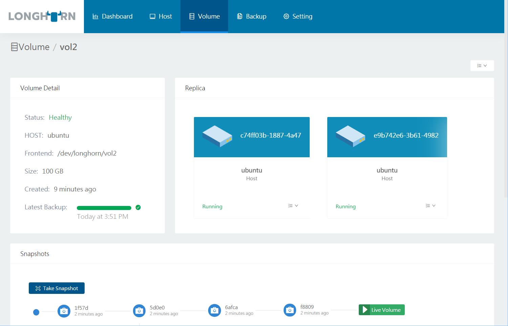

# Quick start guide

Longhornはセットアップが簡単で使いやすいです。 Longhornを単一のUbuntu 16.04サーバー上で実行するために必要なすべてをセットアップできます。 Dockerがインストールされ、パッケージ `open-iscsi` がインストールされていることを確認してください。 次のコマンドを実行して、Longhornを単一ホストにセットアップします。
```
git clone https://github.com/rancher/longhorn
cd longhorn/deploy
./longhorn-setup-single-node-env.sh
```
このスクリプトは、etcd Key-Valueストア、Longhornボリュームマネージャ、Longhorn UI、およびLonghorn dockerボリュームプラグインコンテナを含む複数のコンテナを取得して起動します。 このスクリプトが完了すると、次のような出力が生成されます。
```
Longhorn is up at port 8080
```
`http://<ホスト名またはIP>:8080` に接続して、UIを活用できます。 以下はボリューム詳細画面です。



Docker CLIから永続的なLonghornボリュームを作成できます。

```
docker volume create -d longhorn vol1
docker run -it --volume-driver longhorn -v vol1:/vol1 ubuntu bash
```

単一ホストのLonghornセットアップでは、同じホスト上でetcdとすべてのボリュームレプリカが実行されるため、本番用には適していません。 [Longhorn GitHub page]には、別々のetcdサーバー、Docker Swarmモードのクラスター、およびバックアップを保存するための別々のNFSサーバーを使った実稼働グレードのマルチホスト設定に関する追加の説明が含まれています。
