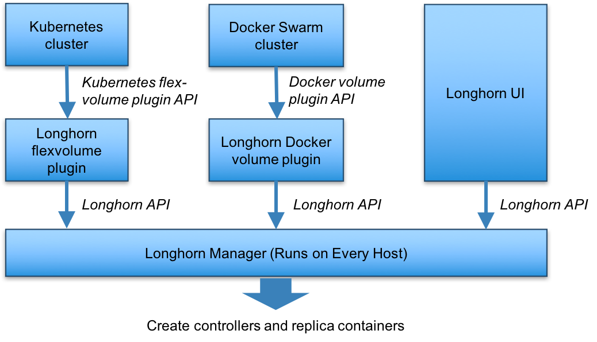
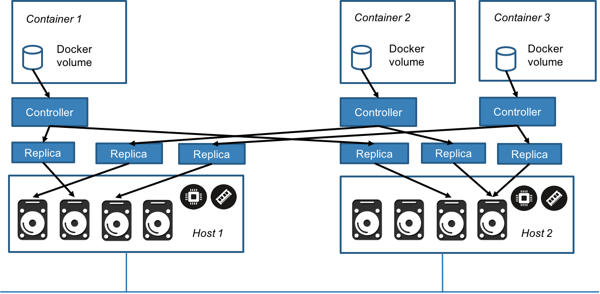

# Volume as a microservice

Longhornボリュームマネージャコンテナは、Longhornクラスタ内の各ホスト上で動作します。
RancherまたはSwarmの用語を使用すると、Longhornボリュームマネージャはグローバルサービスです。
Kubernetesを使用している場合、LonghornボリュームマネージャはDaemonSetと見なされます。
Longhornのボリュームマネージャは、DockerとKubernetesのUIまたはボリュームプラグインからのAPI呼び出しを処理します。
LonghornのAPIの説明があります[[ここ](https://github.com/rancher/longhorn-manager/wiki)]。
以下の図は、Docker SwarmとKubernetesのコンテキストにおけるLonghornの制御パスを示しています。

Longhornマネージャは、ボリュームの作成を要求されると、そのボリュームが接続されているホストと、レプリカが配置されるホストにコントローラコンテナを作成します。
最大限の可用性を確保するために、レプリカは別々のホストに配置する必要があります。
下の図では、Longhornボリュームを持つ3つのコンテナがあります。
各Dockerボリュームには、コンテナーとして動作する専用のコントローラーがあります。
各コントローラには2つのレプリカがあり、各レプリカはコンテナです。
図中の矢印は、Dockerボリューム、コントローラーコンテナー、レプリカコンテナー、およびディスク間の読み取り/書き込みデータフローを示しています。
ボリュームごとに別々のコントローラーを作成することによって、1つのコントローラーに障害が発生しても、他のボリュームの機能は影響を受けません。

たとえば、それぞれ2つのレプリカを持つ10万個のDockerボリュームを持つ大規模展開では、100,000個のコントローラーコンテナーと200,000個のレプリカコンテナーがあります。
これらすべてのコントローラとレプリカをスケジュール、監視、調整、および修復するには、ストレージオーケストレーションシステムが必要です。

