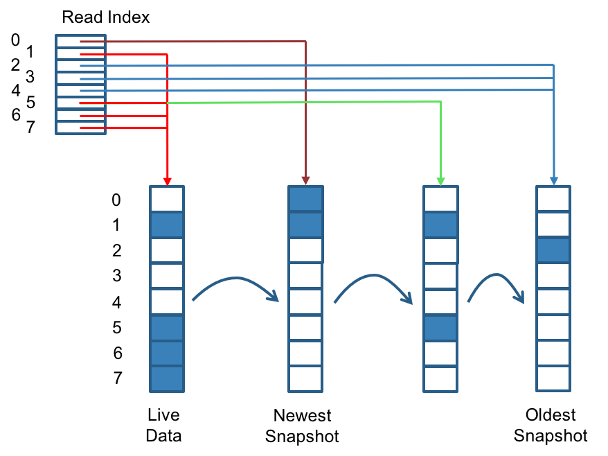

# Replica operations

Longhornレプリカは、シンプロビジョニングをサポートするLinuxスパースファイルを使用して構築されています。 現在どのブロックが使用されているかを示すために追加のメタデータを管理していません。 ブロックサイズは4Kです。 スナップショットを撮ると、差分ディスクが作成されます。 スナップショットの数が増えるにつれて、差分ディスクチェーンはかなり長くなる可能性があります。 したがって、読み取り性能を向上させるために、Longhornはどの差分ディスクが4Kブロックごとに有効なデータを保持しているかを記録する読み取りインデックスを維持します。 次の図では、ボリュームは8ブロックあります。 読み取り索引には8つの項目があり、読み取り操作が行われるにつれて遅れて埋められます。 書き込み操作は読み取りインデックスをリセットし、それがライブデータを指すようにします。

読み取りインデックスはメモリ内に保持され、4Kブロックごとに1バイトを消費します。 バイトサイズの読み取りインデックスでは、各ボリュームに最大254個のスナップショットを作成できます。 読み取りインデックスは、各レプリカに対して一定量のメモリ内データ構造を消費します。 たとえば、1TBのボリュームは256MBのメモリ内読み取りインデックスを消費します。 将来的には、読み取りインデックスをメモリマップファイルに配置することを検討します。

