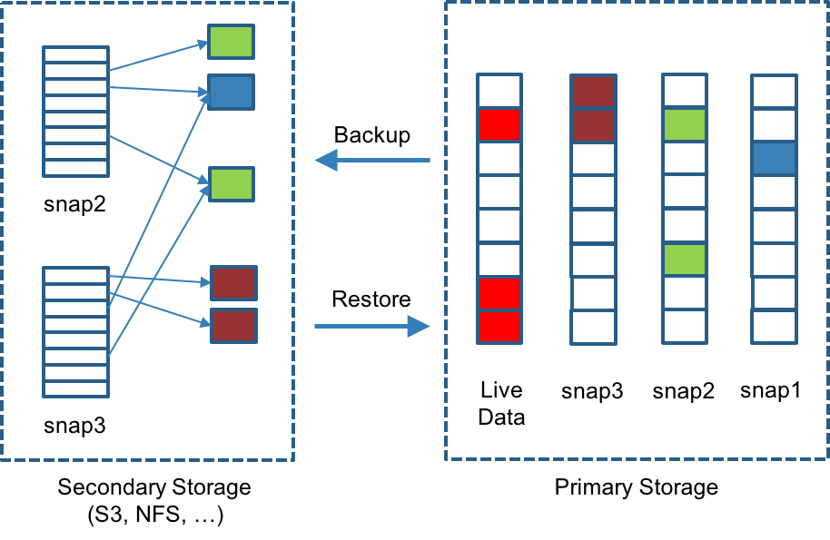
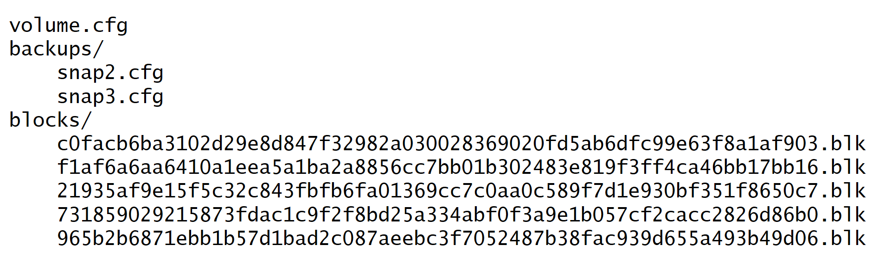

# Backup of snapshots

Amazon EBSのしくみが大好きです - すべてのスナップショットが自動的にS3にバックアップされます。
1次記憶域には何も保持されません。ただし、Longhornのスナップショットとバックアップをもう少し柔軟にすることにしました。
スナップショット操作とバックアップ操作は別々に実行されます。
EBS形式のスナップショットは、スナップショットを作成し、このスナップショットと最後のスナップショットの違いをバックアップし、最後のスナップショットを削除することでシミュレートできます。
また、このような操作を自動的に実行できるように、定期的なバックアップメカニズムも開発しました。
スナップショット間で変更されたブロックを検出して転送することで、効率的な増分バックアップを実現します。
各スナップショットは差分ファイルであり、最後のスナップショットからの変更のみを格納するため、これは比較的簡単な作業です。
非常に多数の小ブロックを保管しないようにするために、2MBブロックを使用してバックアップ操作を実行します。
つまり、2MB境界内の4Kブロックが変更された場合、2MBブロック全体をバックアップする必要があります。
これが管理性と効率性の間の正しいバランスを提供すると私たちは感じます。
次の図では、snap2とsnap3の両方をバックアップしました。
各バックアップは独自の2MBブロックのセットを保持し、2つのバックアップは1つの緑色のブロックと1つの青色のブロックを共有します。
各2MBブロックは一度だけバックアップされます。
セカンダリストレージからバックアップを削除するとき、もちろんそれが使用するすべてのブロックを削除することはできません。
代わりに、定期的にガベージコレクションを実行して、未使用ブロックを二次記憶装置からクリーンアップします。

Longhornは、特定のボリュームのすべてのバックアップを共通のディレクトリに格納します。
次の図は、Longhornがボリュームのバックアップを保存する方法を少し簡略化して示したものです。
ボリュームレベルのメタデータはvolume.cfgに格納されています。
各バックアップ用のメタデータファイル（例えば、snap2.cfg）は、それらがバックアップ内のすべての2MBブロックのオフセットおよびチェックサムのみを含むので、比較的小さい。
同じボリュームに属するすべてのバックアップの2MBブロックは共通のディレクトリに格納されているため、複数のバックアップで共有できます。
2MBブロック（.blkファイル）は圧縮されています。
チェックサムは2MBブロックのアドレス指定に使用されるため、同じボリューム内の2MBブロックに対してある程度の重複排除が行われます。

ボリュームレベルのメタデータはvolume.cfgに格納されています。
各バックアップ用のメタデータファイル（例えば、snap2.cfg）は、それらがバックアップ内のすべての2MBブロックのオフセットおよびチェックサムのみを含むので、比較的小さい。
同じボリュームに属するすべてのバックアップの2MBブロックは共通のディレクトリに格納されているため、複数のバックアップで共有できます。
2MBブロック（.blkファイル）は圧縮されています。
チェックサムは2MBブロックのアドレス指定に使用されるため、同じボリューム内の2MBブロックに対してある程度の重複排除が行われます。

