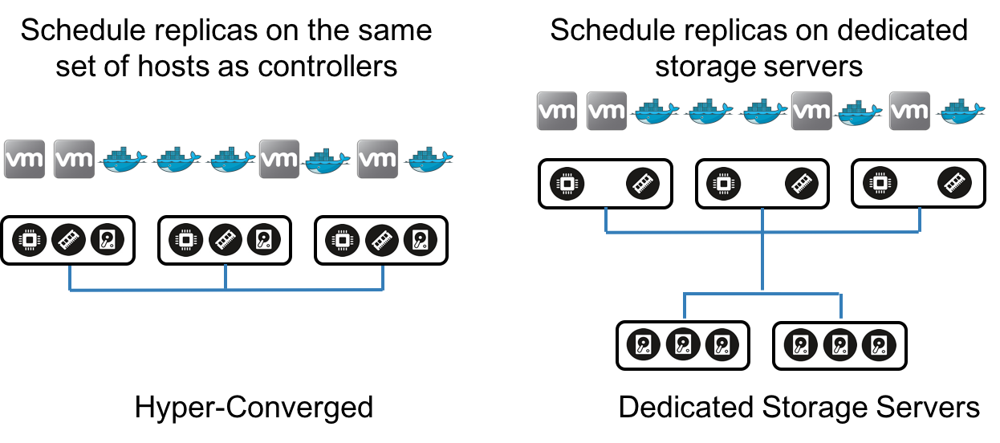

# Two deployment models

Longhornボリュームマネージャは、レプリカをノードにスケジュールするというタスクを実行します。
スケジューリングアルゴリズムを調整して、コントローラとレプリカをさまざまな方法で配置できます。
コントローラは常にボリュームが接続されているホストに配置されます。
一方、レプリカは、コントローラーを実行している同じコンピュートサーバーのセットにも、専用のストレージサーバーのセットにも配置できます。
前者はハイパーコンバージドデプロイメントモデルを構成し、後者は専用のストレージサーバーモデルを構成します。

