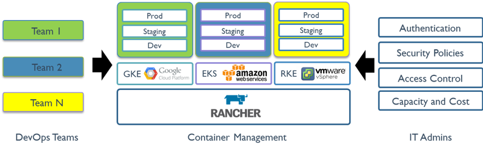

# 概要

Rancherは、実稼働環境でコンテナを展開する組織向けに構築されたコンテナ管理プラットフォームです。 Rancherは、Kubernetesをあらゆる場所で実行し、IT要件を満たし、DevOpsチームを強化することを容易にします。

## Run Kubernetes Everywhere

Kubernetesはコンテナオーケストレーションの標準となりました。 ほとんどのクラウドおよび仮想化ベンダーは現在、標準のインフラストラクチャとしてそれを提供しています。 Rancherユーザーは、Rancher Kubernetes Engine（RKE）またはクラウドKubernetesサービス（GKE、AKS、EKSなど）を使用してKubernetesクラスターを作成することを選択できます。 Rancherユーザーは、任意のKubernetesディストリビューションまたはインストーラーを使用して作成された既存のKubernetesクラスターをインポートして管理することもできます。

## Meet IT requirements

Rancherは、集中管理された認証、アクセス制御、およびその管理下にあるすべてのKubernetesクラスタの監視をサポートしています。 たとえば、次のことができます。

- GKEなどのクラウドベンダーによってホストされているKubernetesクラスタにアクセスするには、Active Directoryの認証情報を使用します。
- すべてのユーザー、グループ、プロジェクト、クラスタ、およびクラウドにわたってアクセス制御とセキュリティポリシーを設定して実施する。
- 一括管理にて、Kubernetesクラスターの健全性と容量を確認できます。

## DevOpsチームに権限を与える

Rancherは、DevOpsのエンジニアがアプリケーションの作業負荷を管理するための直感的なユーザーインターフェイスを提供します。
Rancherを使い始めるのに、ユーザーはKubernetesの概念に関する深い知識を持っている必要はありません。
Rancherカタログには、一連の便利なDevOpsツールが含まれています。
Rancherは、セキュリティツール、監視システム、コンテナレジストリ、ストレージドライバ、ネットワークドライバなど、さまざまなクラウドネイティブエコシステム製品の認定を受けています。
次の図は、ITおよびDevOps組織でRancherが果たす役割を示しています。
各チームは、選択したパブリッククラウドまたはプライベートクラウドにアプリケーションをデプロイします。
IT管理者は可視性を獲得し、すべてのユーザー、クラスター、およびクラウドにわたってポリシーを適用します。

