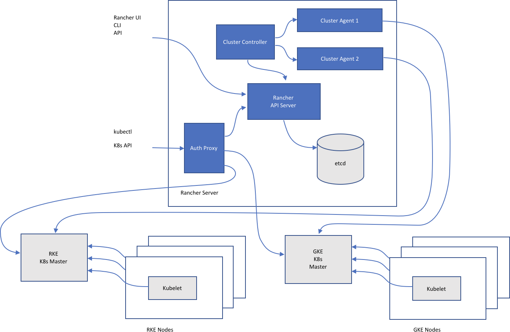

# Architecture

このセクションでは、RancherがRancherの基盤となっている2つの基本テクノロジであるDockerとKubernetesとどのように相互作用するかについて説明します。

## Docker

Dockerはコンテナのパッケージ化とランタイムの標準です。開発者はDockerfilesからコンテナイメージを作成し、Dockerレジストリからコンテナイメージを配布します。Docker Hubは最も人気のある公共のレジストリです。多くの組織はプライベートDockerレジストリも設定しています。Dockerは、主に個々のノード上のコンテナーを管理するために使用されます。

>**注意：**
Rancher 1.6はDocker Swarmクラスタリングテクノロジをサポートしていましたが、Kubernetesの成功により、Rancher 2.xではサポートされなくなりました。

## Kubernetes

Kubernetesはコンテナクラスタ管理標準です。YAMLファイルはアプリケーションを形成するコンテナと他のリソースを指定します。Kubernetesは、スケジューリング、スケーリング、サービス発見、ヘルスチェック、秘密管理、設定管理などの機能を実行します。

Kubernetesクラスタは複数のノードで構成されています。

- etcd database  
1つのノードでのみetcdを実行できますが、HA構成を作成するには通常3、5、またはそれ以上のノードが必要です。
- Master nodes  
マスターノードはステートレスで、APIサーバー、スケジューラー、およびコントローラーを実行するために使用されます。
- Worker nodes  
アプリケーションワークロードはワーカーノードで実行されます。

## Rancher

Rancher 2.xソフトウェアの大部分はRancher Server上で動作します。 Rancher Serverには、Rancher展開全体の管理に使用されるすべてのソフトウェアコンポーネントが含まれています。

以下の図は、Rancher 2.xの上位アーキテクチャを示しています。 この図は、2つのKubernetesクラスタを管理するRancher Serverのインストールを示しています。1つはRKEによって作成され、もう1つはGKEによって作成されます。

このセクションでは、各Rancherサーバーコンポーネントの機能について説明します。

### Rancher API Server

Rancher APIサーバーは、組み込みのKubernetes APIサーバーとetcdデータベースの上に構築されています。以下の機能を実装しています。

- User Management  
Rancher APIサーバーは、Active DirectoryやGitHubなどの外部認証プロバイダに対応するユーザーIDを管理します。
- Authorization  
Rancher APIサーバーはアクセス制御とセキュリティポリシーを管理します。
- Projects  
プロジェクトは、クラスタ内の複数のネームスペースとアクセス制御ポリシーの集まりです。
- Nodes  
Rancher APIサーバーは、すべてのクラスター内のすべてのノードのIDを追跡します。

### Cluster Controller and Agents

クラスタコントローラとクラスタエージェントは、Kubernetesクラスタの管理に必要なビジネスロジックを実装します。

- クラスタコントローラは、グローバルRancherインストールに必要なロジックを実装します。 次のことを行います。
    - クラスターおよびプロジェクトへのアクセス制御ポリシーの構成
    - 以下を呼び出してクラスタをプロビジョニングします。
        - Dockerマシンドライバー
        - RKEやGKEのようなKubernetesエンジン
- 個別のクラスタエージェントインスタンスは、対応するクラスタに必要なロジックを実装します。 次のことを行います。
    - ポッドの作成や各クラスタ内での展開などのワークロード管理
    - 各クラスタのグローバルポリシーで定義されているロールとバインディングの適用
    - クラスターとRancher Server間の通信：イベント、統計、ノード情報、および正常性

### Authentication Proxy

認証プロキシは、すべてのKubernetes API呼び出しを転送します。ローカル認証、Active Directory、GitHubなどの認証サービスと統合されています。すべてのKubernetes API呼び出しで、認証プロキシは呼び出し側を認証し、呼び出しをKubernetesマスターに転送する前に適切なKubernetes偽装ヘッダーを設定します。Rancherはサービスアカウントを使用してKubernetesクラスタと通信します。
