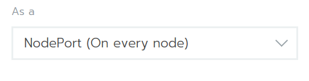
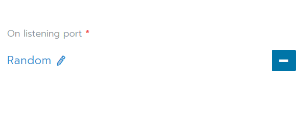
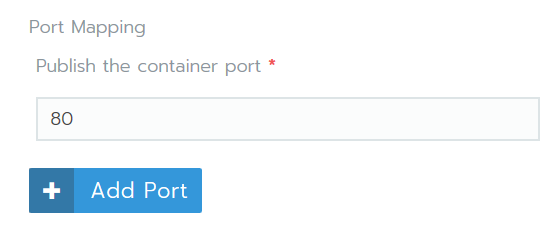

# Workload with NodePort Quick Start

## 前提条件

少なくとも1つのノードを持つ稼働中のクラスターが必要です。

## 1.Deploying a Workload

最初のワークロードを作成する準備が整いました。 ワークロードは、アプリケーションをデプロイするために必要な他のファイルおよび情報とともにポッドを含むオブジェクトです。

このワークロードでは、アプリケーションRancher Hello-Worldをデプロイします。

1. 「クラスタ」ページから、作成したばかりのクラスタを開きます。
1. ダッシュボードのメインメニューから、[Projects/Namespaces]を選択します。
1. デフォルトプロジェクトを開きます。
1. クリックします。  
**ステップ結果：** [Deploy Workload]ページが開きます。
1. ワークロードの名前を入力してください。
1. 「Docker Image」フィールドから、「rancher / hello-world」と入力します。 このフィールドでは大文字と小文字が区別されます。
1. ポートマッピングから、ポートの追加をクリックします。
1. [As as]ドロップダウンから、[NodePort（すべてのノードで）]が選択されていることを確認します。

1. On Listening PortフィールドのRandom値をそのままにします。

1. 「Publish the container port」フィールドにport 80と入力します。

1. 残りのオプションはデフォルト設定のままにします。 それらについては後で話します。
1. 起動をクリックします。

**結果：** 
- ワークロードが展開されている。 このプロセスが完了するまでに数分かかることがあります。
- ワークロードが展開を完了すると、アクティブの状態が割り当てられます。 このステータスは、プロジェクトの[ワークロード]ページから確認できます。

## 2.Viewing Your Application

「ワークロード」ページから、ワークロードの下にあるリンクをクリックします。 配備が成功すると、アプリケーションが開きます。

### Attention: Cloud-Hosted Sandboxes

クラウドでホストされている仮想マシンを使用している場合は、コンテナを実行しているポートにアクセスできない可能性があります。 この場合、ローカルマシンのsshセッションでNginxをテストすることができます。 ワークロードの下のリンクで、`：`の後にポート番号を使用します。この例では`31568`です。

```
gettingstarted@rancher:~$ curl http://localhost:31568
<!DOCTYPE html>
<html>
  <head>
    <title>Rancher</title>
    <link rel="icon" href="img/favicon.png">
    <style>
      body {
        background-color: white;
        text-align: center;
        padding: 50px;
        font-family: "Open Sans","Helvetica Neue",Helvetica,Arial,sans-serif;
      }
      button {
          background-color: #0075a8;
          border: none;
          color: white;
          padding: 15px 32px;
          text-align: center;
          text-decoration: none;
          display: inline-block;
          font-size: 16px;
      }

      #logo {
        margin-bottom: 40px;
      }
    </style>
  </head>
  <body>
    
    <h1>Hello world!</h1>
    <h3>My hostname is hello-world-66b4b9d88b-78bhx</h3>
    <div id='Services'>
      <h3>k8s services found 2</h3>

      <b>INGRESS_D1E1A394F61C108633C4BD37AEDDE757</b> tcp://10.43.203.31:80<br />

      <b>KUBERNETES</b> tcp://10.43.0.1:443<br />

    </div>
    <br />

    <div id='rancherLinks' class="row social">
      <a class="p-a-xs" href="https://rancher.com/docs"></a>
      <a class="p-a-xs" href="https://slack.rancher.io/"></a>
      <a class="p-a-xs" href="https://github.com/rancher/rancher"></a>
      <a class="p-a-xs" href="https://twitter.com/Rancher_Labs"></a>
      <a class="p-a-xs" href="https://www.facebook.com/rancherlabs/"></a>
      <a class="p-a-xs" href="https://www.linkedin.com/groups/6977008/profile"></a>
    </div>
    <br />
    <button class='button' onclick='myFunction()'>Show request details</button>
    <div id="reqInfo" style='display:none'>
      <h3>Request info</h3>
      <b>Host:</b> 172.22.101.111:31411 <br />
      <b>Pod:</b> hello-world-66b4b9d88b-78bhx </b><br />

      <b>Accept:</b> [*/*]<br />

      <b>User-Agent:</b> [curl/7.47.0]<br />

    </div>
    <br />
    <script>
      function myFunction() {
          var x = document.getElementById("reqInfo");
          if (x.style.display === "none") {
              x.style.display = "block";
          } else {
              x.style.display = "none";
          }
      }
    </script>
  </body>
</html>
gettingstarted@rancher:~$
```

### Finished

おめでとうございます。 NodePortを介して公開されたワークロードを正常にデプロイしました。

### What’s Next?

サンドボックスを使い終わったら、Rancher Serverとクラスタを破壊します。 次のいずれかを参照してください。

- Amazon AWS: Destroying the Environment
- DigitalOcean: Destroying the Environment
- Vagrant: Destroying the Environment
