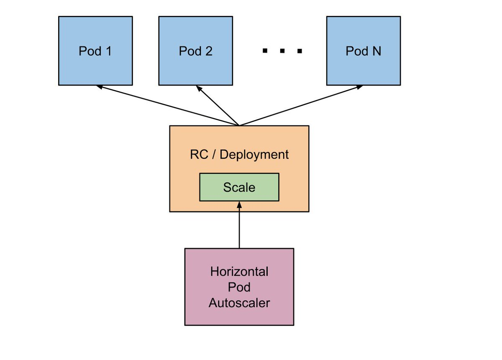

# Horizontal Pod Autoscaler

Kubernetes [Horizontal Pod Autoscaler](https://kubernetes.io/docs/tasks/run-application/horizontal-pod-autoscale/) 機能（HPA）を使用して、実行中のサービスを自動的に拡大または縮小するようにクラスタを設定できます。

> **Note：**  
> Rancher v2.0.7以降で作成されたクラスターには、Horizontal Pod Autoscalerを使用するために必要なすべての要件（metrics-serverおよびKubernetesクラスター構成）があります。

# Why Use Horizontal Pod Autoscaler?

HPAを使用すると、レプリケーションコントローラ内のポッドの数、デプロイメント、またはレプリカのセットアップまたはダウンを自動的に調整できます。
HPAは自動的に最大効率のために実行されているポッドの数を調整します。
ポッドの数に影響を与える要因は次のとおりです。

- ユーザーが定義した、実行が許可されているポッドの最小数と最大数。
- リソースメトリックで報告されているように、観察されたCPU /メモリ使用量。
- Prometheus、Datadogなどのサードパーティ製メトリックアプリケーションによって提供されるカスタムメトリック。

HPAはあなたのサービスを向上させます。

- 過剰な数のポッドによって無駄にされるであろうハードウェアリソースの解放。
- サービスレベル契約を達成するために必要に応じてパフォーマンスを増減します。

## How HPA Works



HPAは、以下の `kube-controller-manager` フラグによって制御される期間を持つ制御ループとして実装されています。

| Flag | Default | Description |
| --- | --- | --- |
| `--horizontal-pod-autoscaler-sync-period` | `30s` | HPAがデプロイメント内のリソース/カスタムメトリクスを監査する頻度 |
| `--horizontal-pod-autoscaler-downscale-delay` | `5m0s` | ダウンスケール操作の完了後、HPAが別のダウンスケール操作を開始するまでに待機する時間 |
| `--horizontal-pod-autoscaler-upscale-delay` | `3m0s` | 上位操作の完了後、HPAが別の上位操作を起動するまでに待機する時間 |

HPAに関する完全なドキュメントは、[Kubernetesのドキュメント](https://kubernetes.io/docs/tasks/run-application/horizontal-pod-autoscale/)を参照してください。

## Horizontal Pod Autoscaler API Objects

HPAは、Kubernetes `autoscaling` APIグループのAPIリソースです。
現在の安定版は `autoscaling/v1` で、これにはCPUの自動スケーリングのサポートしか含まれていません。
メモリとカスタムメトリクスに基づくスケーリングの追加サポートを受けるには、代わりにベータ版を使用してください：`autoscaling/v2beta1`

HPA APIオブジェクトについて詳しくは、[HPA GitHub Readme](https://github.com/kubernetes/community/blob/master/contributors/design-proposals/autoscaling/horizontal-pod-autoscaler.md#horizontalpodautoscaler-object)を参照してください。

## kubectl Commands

kubectlを使用してHPAを作成、管理、および削除できます。

- Creating HPA
    - マニフェストとは：`kubectl create -f <HPA_MANIFEST>`
    - マニフェストなし（CPUをサポート）：`kubectl autoscale deployment hello-world --min=2 --max=5 --cpu-percent=50`
- Getting HPA info
    - 基本：`kubectl get hpa hello-world`
    - 詳細な説明：`kubectl describe hpa hello-world`
- Deleting HPA
    - `kubectl delete hpa hello-world`

## HPA Manifest Definition Example

次のスニペットは、HPAマニフェストでのさまざまな指令の使用方法を示しています。
各ディレクティブの目的を理解するには、サンプルの下のリストを参照してください。

```
apiVersion: autoscaling/v2beta1
kind: HorizontalPodAutoscaler
metadata:
  name: hello-world
spec:
  scaleTargetRef:
    apiVersion: extensions/v1beta1
    kind: Deployment
    name: hello-world
  minReplicas: 1
  maxReplicas: 10
  metrics:
  - type: Resource
    resource:
      name: cpu
      targetAverageUtilization: 50
  - type: Resource
    resource:
      name: memory
      targetAverageValue: 100Mi
```

| Directive | Description |
| --- | --- |
| `apiVersion: autoscaling/v2beta1` | 使用中のKubernetes `autoscaling` APIグループのバージョン。このサンプルマニフェストはベータ版を使用しているため、CPUとメモリによるスケーリングが有効になっています。 |
| `name: hello-world` | HPAが `hello-word` デプロイメントに対して自動スケーリングを実行していることを示します。 |
| `minReplicas: 1` | 実行中のレプリカの最小数が1以下にならないことを示します。 |
| `maxReplicas: 10` | 配置内のレプリカの最大数が10を超えることができないことを示します。 |
| `targetAverageUtilization: 50` | 実行中の平均ポッドで要求されたCPUの50％以上が使用されると、デプロイメントがポッドをスケールアップすることを示します。 |
| `targetAverageValue: 100Mi` | 平均実行中のポッドが100Miを超えるメモリを使用するときに、デプロイメントがポッドをスケールアップすることを示します。 |

### Configuring HPA to Scale Using Resource Metrics

Rancher v2.0.7以降で作成されたクラスターには、Horizontal Pod Autoscalerを使用するために必要なすべての要件（metrics-serverおよびKubernetesクラスター構成）があります。
以下のコマンドを実行して、メトリックがインストール済み環境で使用可能かどうかを確認します。

```
$ kubectl top nodes
NAME                              CPU(cores)   CPU%      MEMORY(bytes)   MEMORY%
node-controlplane   196m         9%        1623Mi          42%
node-etcd           80m          4%        1090Mi          28%
node-worker         64m          3%        1146Mi          29%
$ kubectl -n kube-system top pods
NAME                                   CPU(cores)   MEMORY(bytes)
canal-pgldr                            18m          46Mi
canal-vhkgr                            20m          45Mi
canal-x5q5v                            17m          37Mi
canal-xknnz                            20m          37Mi
kube-dns-7588d5b5f5-298j2              0m           22Mi
kube-dns-autoscaler-5db9bbb766-t24hw   0m           5Mi
metrics-server-97bc649d5-jxrlt         0m           12Mi
$ kubectl -n kube-system logs -l k8s-app=metrics-server
I1002 12:55:32.172841       1 heapster.go:71] /metrics-server --source=kubernetes.summary_api:https://kubernetes.default.svc?kubeletHttps=true&kubeletPort=10250&useServiceAccount=true&insecure=true
I1002 12:55:32.172994       1 heapster.go:72] Metrics Server version v0.2.1
I1002 12:55:32.173378       1 configs.go:61] Using Kubernetes client with master "https://kubernetes.default.svc" and version
I1002 12:55:32.173401       1 configs.go:62] Using kubelet port 10250
I1002 12:55:32.173946       1 heapster.go:128] Starting with Metric Sink
I1002 12:55:32.592703       1 serving.go:308] Generated self-signed cert (apiserver.local.config/certificates/apiserver.crt, apiserver.local.config/certificates/apiserver.key)
I1002 12:55:32.925630       1 heapster.go:101] Starting Heapster API server...
[restful] 2018/10/02 12:55:32 log.go:33: [restful/swagger] listing is available at https:///swaggerapi
[restful] 2018/10/02 12:55:32 log.go:33: [restful/swagger] https:///swaggerui/ is mapped to folder /swagger-ui/
I1002 12:55:32.928597       1 serve.go:85] Serving securely on 0.0.0.0:443
```

Rancher v2.0.6以前でクラスタを作成したことがある場合は、[手動インストール](https://rancher.com/docs/rancher/v2.x/en/k8s-in-rancher/horitzontal-pod-autoscaler/#manual-installation)を参照してください。

### Configuring HPA to Scale Using Custom Metrics (Prometheus)

サードパーティ製ソフトウェアによって提供されるカスタムメトリクスに基づいて自動スケールするようにHPAを設定することもできます。
サードパーティソフトウェアを使用した自動スケーリングの最も一般的なユースケースは、アプリケーションレベルのメトリック（つまり、1秒あたりのHTTP要求）に基づいています。
HPAは`custom.metrics.k8s.io` APIを使用してこれらのメトリックを消費します。
このAPIは、メトリック収集ソリューション用のカスタムメトリックアダプタをデプロイすることによって有効になります。

この例では、[Prometheus](https://prometheus.io/) を使用します。
我々は以下の仮定から始めています：

- Prometheus はクラスタにデプロイされています。
- Prometheus は正しく設定され、ポッド、ノード、ネームスペースなどから適切なメトリックを収集します。
- Prometheus は、次のURLとポートに公開されています。`http://prometheus.mycompany.io:80`

Prometheusは、Rancher v2.0カタログで展開できます。
クラスタでまだ実行されていない場合は、Rancherカタログから展開します。

HPAがPrometheusのカスタムメトリックを使用するには、クラスタの `kube-system` ネームスペースにパッケージ [k8s-prometheus-adapter](https://github.com/DirectXMan12/k8s-prometheus-adapter) が必要です。
`k8s-prometheus-adapter` をインストールするために、[banzai-charts](https://github.com/banzaicloud/banzai-charts) で利用可能なHelmチャートを使用しています。

1. クラスタでHelmを初期化します。
    ```
    # kubectl -n kube-system create serviceaccount tiller
    kubectl create clusterrolebinding tiller --clusterrole cluster-admin --serviceaccount=kube-system:tiller
    helm init --service-account tiller
    ```
1. GitHubから `banzai-charts` レポをクローンします。
    ```
    # git clone https://github.com/banzaicloud/banzai-charts
    ```
1. PrometheusのURLとポート番号を指定して、`prometheus-adapter` チャートをインストールします。
    ```
    # helm install --name prometheus-adapter banzai-charts/prometheus-adapter --set prometheus.url="http://prometheus.mycompany.io",prometheus.port="80" --namespace kube-system
    ```
1. `prometheus-adapter` が正しく実行されていることを確認してください。
サービスポッドを確認し、`kube-system` ネームスペースにログインします。
    1. サービスポッドが実行中であることを確認してください。
    次のコマンドを入力してください。
        ```
        # kubectl get pods -n kube-system
        ```
        結果の出力から、`Running` の状況を探します。
        ```
        NAME                                  READY     STATUS    RESTARTS   AGE
        ...
        prometheus-adapter-prometheus-adapter-568674d97f-hbzfx   1/1       Running   0          7h
        ...
        ```
    1. 次のコマンドを入力して、サービスログを調べてサービスが正しく実行されていることを確認します。
        ```
        # kubectl logs prometheus-adapter-prometheus-adapter-568674d97f-hbzfx -n kube-system
        ```
        その後、ログ出力を調べて、サービスが実行されていることを確認してください。  
        
        [Prometheus Adaptor Logs](0201prometheusadaptorlogs.md)

1. メトリックAPIがkubectlからアクセス可能であることを確認してください。
    - クラスタに直接アクセスしている場合は、kubectl configに次の形式でサーバーのURLを入力します：`https://<Kubernetes_URL>:6443`
        ```
        # kubectl get --raw /apis/custom.metrics.k8s.io/v1beta1
        ```
        APIにアクセスできる場合は、次のような出力を受け取るはずです。

        [API Response](0202APIresponse.md)

    - Rancherを介してクラスターにアクセスしている場合は、kubectl configにサーバーURLを`https://<RANCHER_URL>/k8s/cluster/<CLUSTER_ID>` の形式で入力します。
    APIパスに `/k8s/cluster/<CLUSTER_ID>` というサフィックスを追加します。
        ```
        # kubectl get --raw /k8s/clusters/<CLUSTER_ID>/apis/custom.metrics.k8s.io/v1beta1
        ```
        APIにアクセスできる場合は、次のような出力を受け取るはずです。

        [API Response](0203APIresponse.md)

## Testing HPAs with a Service Deployment

HPAが正しく機能するためには、サービス展開にコンテナの定義を要求するリソースが必要です。
このhello-worldの例に従って、HPAが正しく機能しているかどうかをテストしてください。

1. Kubernetesクラスタに接続するようにkubectlを設定します。

1. 以下に `hello-world` 展開マニフェストをコピーしてください。
    
    Hello World Manifest
    ```
    apiVersion: apps/v1beta2
    kind: Deployment
    metadata:
        labels:
            app: hello-world
        name: hello-world
        namespace: default
    spec:
        replicas: 1
        selector:
            matchLabels:
                app: hello-world
        strategy:
            rollingUpdate:
                maxSurge: 1
                maxUnavailable: 0
            type: RollingUpdate
        template:
            metadata:
                labels:
                    app: hello-world
            spec:
                containers:
                    - image: rancher/hello-world
                    imagePullPolicy: Always
                    name: hello-world
                    resources:
                        requests:
                            cpu: 500m
                            memory: 64Mi
                    ports:
                        - containerPort: 80
                        protocol: TCP
            restartPolicy: Always
    ---
    apiVersion: v1
    kind: Service
    metadata:
        name: hello-world
        namespace: default
    spec:
        ports:
            - port: 80
            protocol: TCP
            targetPort: 80
        selector:
            app: hello-world
    ```

1. クラスタに配置します。

    ```
    # kubectl create -f <HELLO_WORLD_MANIFEST>
    ```

1. 使用している指標の種類に基づいて、次のいずれかのHPAをコピーします。

    - Hello World HPA: Resource Metrics
        ```
        apiVersion: autoscaling/v2beta1
        kind: HorizontalPodAutoscaler
        metadata:
            name: hello-world
            namespace: default
        spec:
            scaleTargetRef:
                apiVersion: extensions/v1beta1
                kind: Deployment
                name: hello-world
            minReplicas: 1
            maxReplicas: 10
        metrics:
        - type: Resource
            resource:
                name: cpu
                targetAverageUtilization: 50
        - type: Resource
            resource:
                name: memory
                targetAverageValue: 1000Mi
        ```

    - Hello World HPA: Custom Metrics
        ```
        apiVersion: autoscaling/v2beta1
        kind: HorizontalPodAutoscaler
        metadata:
            name: hello-world
            namespace: default
        spec:
            scaleTargetRef:
                apiVersion: extensions/v1beta1
                kind: Deployment
                name: hello-world
            minReplicas: 1
            maxReplicas: 10
            metrics:
            - type: Resource
                resource:
                    name: cpu
                    targetAverageUtilization: 50
            - type: Resource
                resource:
                    name: memory
                    targetAverageValue: 100Mi
            - type: Pods
                pods:
                    metricName: cpu_system
                    targetAverageValue: 20m
        ```

1. HPAの情報と説明を参照してください。
メトリックデータが表示されていることを確認します。

    Resource Metrics

    - 以下のコマンドを入力してください。
        ```
        # kubectl get hpa
        NAME          REFERENCE                TARGETS                     MINPODS   MAXPODS   REPLICAS   AGE
        hello-world   Deployment/hello-world   1253376 / 100Mi, 0% / 50%   1         10        1          6m
        # kubectl describe hpa
        Name:                                                  hello-world
        Namespace:                                             default
        Labels:                                                <none>
        Annotations:                                           <none>
        CreationTimestamp:                                     Mon, 23 Jul 2018 20:21:16 +0200
        Reference:                                             Deployment/hello-world
        Metrics:                                               ( current / target )
            resource memory on pods:                             1253376 / 100Mi
            resource cpu on pods  (as a percentage of request):  0% (0) / 50%
        Min replicas:                                          1
        Max replicas:                                          10
        Conditions:
            Type            Status  Reason              Message
            ----            ------  ------              -------
            AbleToScale     True    ReadyForNewScale    the last scale time was sufficiently old as to warrant a new scale
            ScalingActive   True    ValidMetricFound    the HPA was able to successfully calculate a replica count from memory resource
            ScalingLimited  False   DesiredWithinRange  the desired count is within the acceptable range
        Events:           <none>
        ```

    Custom Metrics

    - 次のコマンドを入力してください。
        ```
        # kubectl describe hpa
        ```
        以下のような出力を受け取るはずです。
        ```
        Name:                                                  hello-world
        Namespace:                                             default
        Labels:                                                <none>
        Annotations:                                           <none>
        CreationTimestamp:                                     Tue, 24 Jul 2018 18:36:28 +0200
        Reference:                                             Deployment/hello-world
        Metrics:                                               ( current / target )
            resource memory on pods:                             3514368 / 100Mi
            "cpu_system" on pods:                                0 / 20m
            resource cpu on pods  (as a percentage of request):  0% (0) / 50%
        Min replicas:                                          1
        Max replicas:                                          10
        Conditions:
            Type            Status  Reason              Message
            ----            ------  ------              -------
            AbleToScale     True    ReadyForNewScale    the last scale time was sufficiently old as to warrant a new scale
            ScalingActive   True    ValidMetricFound    the HPA was able to successfully calculate a replica count from memory resource
            ScalingLimited  False   DesiredWithinRange  the desired count is within the acceptable range
        Events:           <none>
        ```

1. あなたのポッドが意図したとおりに自動縮尺であることをテストするためのサービスのための負荷を生成します。
負荷テストツール（Hey、Gatlingなど）を使用できますが、[Hey](https://github.com/rakyll/hey)を使用しています。

1. ポッドの自動スケーリングが意図したとおりに機能することをテストします。

    **リソースメトリックを使用して自動スケーリングをテストするには**

    #### Upscale to 2 Pods: CPU Usage Up to Target

    負荷テストツールを使用して、CPU使用率に基づいて2つのポッドにスケールアップします。

    - あなたのHPAを見てください。
        ```
        # kubectl describe hpa
        ```
        以下のような出力を受け取るはずです。
        ```
        Name:                                                  hello-world
        Namespace:                                             default
        Labels:                                                <none>
        Annotations:                                           <none>
        CreationTimestamp:                                     Mon, 23 Jul 2018 22:22:04 +0200
        Reference:                                             Deployment/hello-world
        Metrics:                                               ( current / target )
            resource memory on pods:                             10928128 / 100Mi
            resource cpu on pods  (as a percentage of request):  56% (280m) / 50%
        Min replicas:                                          1
        Max replicas:                                          10
        Conditions:
            Type            Status  Reason              Message
            ----            ------  ------              -------
            AbleToScale     True    SucceededRescale    the HPA controller was able to update the target scale to 2
            ScalingActive   True    ValidMetricFound    the HPA was able to successfully calculate a replica count from cpu resource utilization (percentage of request)
            ScalingLimited  False   DesiredWithinRange  the desired count is within the acceptable range
        Events:
            Type    Reason             Age   From                       Message
            ----    ------             ----  ----                       -------
            Normal  SuccessfulRescale  13s   horizontal-pod-autoscaler  New size: 2; reason: cpu resource utilization (percentage of request) above target
        ```

    - 次のコマンドを入力して、2つのポッドに拡大したことを確認します。
        ```
        # kubectl get pods
        ```
        次のような出力を受け取るはずです。
        ```
        NAME                                                     READY     STATUS    RESTARTS   AGE
        hello-world-54764dfbf8-k8ph2                             1/1       Running   0          1m
        hello-world-54764dfbf8-q6l4v                             1/1       Running   0          3h
        ```

    #### Upscale to 3 pods: CPU Usage Up to Target

    負荷テストツールを使用して、`horizontal-pod-autoscaler-upscale-delay` を3分に設定し、CPU使用率に基づいて3ポッドまでアップスペースします。

    - 次のコマンドを入力してください。
        ```
        # kubectl describe hpa
        ```
        以下のような出力を受け取るはずです。
        ```
        Name:                                                  hello-world
        Namespace:                                             default
        Labels:                                                <none>
        Annotations:                                           <none>
        CreationTimestamp:                                     Mon, 23 Jul 2018 22:22:04 +0200
        Reference:                                             Deployment/hello-world
        Metrics:                                               ( current / target )
            resource memory on pods:                             9424896 / 100Mi
            resource cpu on pods  (as a percentage of request):  66% (333m) / 50%
        Min replicas:                                          1
        Max replicas:                                          10
        Conditions:
            Type            Status  Reason              Message
            ----            ------  ------              -------
            AbleToScale     True    SucceededRescale    the HPA controller was able to update the target scale to 3
            ScalingActive   True    ValidMetricFound    the HPA was able to successfully calculate a replica count from cpu resource utilization (percentage of request)
            ScalingLimited  False   DesiredWithinRange  the desired count is within the acceptable range
        Events:
            Type    Reason             Age   From                       Message
            ----    ------             ----  ----                       -------
            Normal  SuccessfulRescale  4m    horizontal-pod-autoscaler  New size: 2; reason: cpu resource utilization (percentage of request) above target
            Normal  SuccessfulRescale  16s   horizontal-pod-autoscaler  New size: 3; reason: cpu resource utilization (percentage of request) above target

    - 次のコマンドを入力して、3つのポッドが動作していることを確認します。
        ```
        # kubectl get pods
        ```
        以下のような出力を受け取るはずです。
        ```
        NAME                                                     READY     STATUS    RESTARTS   AGE
        hello-world-54764dfbf8-f46kh                             0/1       Running   0          1m
        hello-world-54764dfbf8-k8ph2                             1/1       Running   0          5m
        hello-world-54764dfbf8-q6l4v                             1/1       Running   0          3h
        ```

    #### Downscale to 1 Pod: All Metrics Below Target

    すべての測定基準が`horizontal-pod-autoscaler-downscale-delay`（デフォルトで5分）の目標を下回っている場合は、負荷テストを使用して1 podまでスケールダウンします。

    - 次のコマンドを入力してください。
        ```
        # kubectl describe hpa
        ```
        以下のような出力を受け取るはずです。
        ```
        Name:                                                  hello-world
        Namespace:                                             default
        Labels:                                                <none>
        Annotations:                                           <none>
        CreationTimestamp:                                     Mon, 23 Jul 2018 22:22:04 +0200
        Reference:                                             Deployment/hello-world
        Metrics:                                               ( current / target )
            resource memory on pods:                             10070016 / 100Mi
            resource cpu on pods  (as a percentage of request):  0% (0) / 50%
        Min replicas:                                          1
        Max replicas:                                          10
        Conditions:
            Type            Status  Reason              Message
            ----            ------  ------              -------
            AbleToScale     True    SucceededRescale    the HPA controller was able to update the target scale to 1
            ScalingActive   True    ValidMetricFound    the HPA was able to successfully calculate a replica count from memory resource
            ScalingLimited  False   DesiredWithinRange  the desired count is within the acceptable range
        Events:
            Type    Reason             Age   From                       Message
            ----    ------             ----  ----                       -------
            Normal  SuccessfulRescale  10m   horizontal-pod-autoscaler  New size: 2; reason: cpu resource utilization (percentage of request) above target
            Normal  SuccessfulRescale  6m    horizontal-pod-autoscaler  New size: 3; reason: cpu resource utilization (percentage of request) above target
            Normal  SuccessfulRescale  1s    horizontal-pod-autoscaler  New size: 1; reason: All metrics below target
        ```

    **カスタムメトリックを使用して自動スケーリングをテストするには**

    #### Upscale to 2 Pods: CPU Usage Up to Target

    負荷テストツールを使用して、CPU使用率に基づいて2つのポッドを拡張します。

    - 次のコマンドを入力してください。
        ```
        # kubectl describe hpa
        ```
        以下のような出力を受け取るはずです。
        ```
        Name:                                                  hello-world
        Namespace:                                             default
        Labels:                                                <none>
        Annotations:                                           <none>
        CreationTimestamp:                                     Tue, 24 Jul 2018 18:01:11 +0200
        Reference:                                             Deployment/hello-world
        Metrics:                                               ( current / target )
            resource memory on pods:                             8159232 / 100Mi
            "cpu_system" on pods:                                7m / 20m
            resource cpu on pods  (as a percentage of request):  64% (321m) / 50%
        Min replicas:                                          1
        Max replicas:                                          10
        Conditions:
            Type            Status  Reason              Message
            ----            ------  ------              -------
            AbleToScale     True    SucceededRescale    the HPA controller was able to update the target scale to 2
            ScalingActive   True    ValidMetricFound    the HPA was able to successfully calculate a replica count from cpu resource utilization (percentage of request)
            ScalingLimited  False   DesiredWithinRange  the desired count is within the acceptable range
        Events:
            Type    Reason             Age   From                       Message
            ----    ------             ----  ----                       -------
            Normal  SuccessfulRescale  16s   horizontal-pod-autoscaler  New size: 2; reason: cpu resource utilization (percentage of request) above target
        ```

    - 次のコマンドを入力して、2つのポッドが動作していることを確認します。
    
        ```
        # kubectl get pods
        ```
        以下のような出力を受け取るはずです。
        ```
            NAME                           READY     STATUS    RESTARTS   AGE
            hello-world-54764dfbf8-5pfdr   1/1       Running   0          3s
            hello-world-54764dfbf8-q6l82   1/1       Running   0          6h
        ```

    #### Upscale to 3 Pods: CPU Usage Up to Target

    cpu_systemの使用限度が目標に達している場合は、負荷テストツールを使用して3つのポッドにスケールアップします。

    - 次のコマンドを入力してください。
        ```
        # kubectl describe hpa
        ```
        次のような出力を受け取るはずです。
        ```
        Name:                                                  hello-world
        Namespace:                                             default
        Labels:                                                <none>
        Annotations:                                           <none>
        CreationTimestamp:                                     Tue, 24 Jul 2018 18:01:11 +0200
        Reference:                                             Deployment/hello-world
        Metrics:                                               ( current / target )
            resource memory on pods:                             8374272 / 100Mi
            "cpu_system" on pods:                                27m / 20m
            resource cpu on pods  (as a percentage of request):  71% (357m) / 50%
        Min replicas:                                          1
        Max replicas:                                          10
        Conditions:
            Type            Status  Reason              Message
            ----            ------  ------              -------
            AbleToScale     True    SucceededRescale    the HPA controller was able to update the target scale to 3
            ScalingActive   True    ValidMetricFound    the HPA was able to successfully calculate a replica count from cpu resource utilization (percentage of request)
            ScalingLimited  False   DesiredWithinRange  the desired count is within the acceptable range
        Events:
            Type    Reason             Age   From                       Message
            ----    ------             ----  ----                       -------
            Normal  SuccessfulRescale  3m    horizontal-pod-autoscaler  New size: 2; reason: cpu resource utilization (percentage of request) above target
            Normal  SuccessfulRescale  3s    horizontal-pod-autoscaler  New size: 3; reason: pods metric cpu_system above target
        ```

    - 次のコマンドを入力して、3つのポッドが動作していることを確認します。
        ```
        # kubectl get pods
        ```
        次のような出力を受け取るはずです。
        ```
        # kubectl get pods
        NAME                           READY     STATUS    RESTARTS   AGE
        hello-world-54764dfbf8-5pfdr   1/1       Running   0          3m
        hello-world-54764dfbf8-m2hrl   1/1       Running   0          1s
        hello-world-54764dfbf8-q6l82   1/1       Running   0          6h
        ```
    
    #### Upscale to 4 Pods: CPU Usage Up to Target

    負荷テストツールを使用して、CPU使用率に基づいて4つのポッドに拡張します。
    `horizontal-pod-autoscaler-upscale-delay`はデフォルトで3分に設定されています。

    - 次のコマンドを入力してください。
        ```
        # kubectl describe hpa
        ```
        以下のような出力を受け取るはずです。
        ```
        Name:                                                  hello-world
        Namespace:                                             default
        Labels:                                                <none>
        Annotations:                                           <none>
        CreationTimestamp:                                     Tue, 24 Jul 2018 18:01:11 +0200
        Reference:                                             Deployment/hello-world
        Metrics:                                               ( current / target )
            resource memory on pods:                             8374272 / 100Mi
            "cpu_system" on pods:                                27m / 20m
            resource cpu on pods  (as a percentage of request):  71% (357m) / 50%
        Min replicas:                                          1
        Max replicas:                                          10
        Conditions:
            Type            Status  Reason              Message
            ----            ------  ------              -------
            AbleToScale     True    SucceededRescale    the HPA controller was able to update the target scale to 3
            ScalingActive   True    ValidMetricFound    the HPA was able to successfully calculate a replica count from cpu resource utilization (percentage of request)
            ScalingLimited  False   DesiredWithinRange  the desired count is within the acceptable range
        Events:
            Type    Reason             Age   From                       Message
            ----    ------             ----  ----                       -------
            Normal  SuccessfulRescale  5m    horizontal-pod-autoscaler  New size: 2; reason: cpu resource utilization (percentage of request) above target
            Normal  SuccessfulRescale  3m    horizontal-pod-autoscaler  New size: 3; reason: pods metric cpu_system above target
            Normal  SuccessfulRescale  4s    horizontal-pod-autoscaler  New size: 4; reason: cpu resource utilization (percentage of request) above target
        ```

    - 次のコマンドを入力して、4つのポッドが動作していることを確認します。
        ```
        # kubectl get pods
        ```
        以下のような出力を受け取るはずです。
        ```
        NAME                           READY     STATUS    RESTARTS   AGE
        hello-world-54764dfbf8-2p9xb   1/1       Running   0          5m
        hello-world-54764dfbf8-5pfdr   1/1       Running   0          2m
        hello-world-54764dfbf8-m2hrl   1/1       Running   0          1s
        hello-world-54764dfbf8-q6l82   1/1       Running   0          6h
        ```

    #### Downscale to 1 Pod: All Metrics Below Target

    以下のすべての指標が`horizontal-pod-autoscaler-downscale-delay`をターゲットにしている場合は、負荷テストツールを使用して1つのポッドにスケールダウンします。

    - 次のコマンドを入力してください。
        ```
        # kubectl describe hpa
        ```
        次のような出力が得られるはずです。
        ```
        Name:                                                  hello-world
        Namespace:                                             default
        Labels:                                                <none>
        Annotations:                                           <none>
        CreationTimestamp:                                     Tue, 24 Jul 2018 18:01:11 +0200
        Reference:                                             Deployment/hello-world
        Metrics:                                               ( current / target )
            resource memory on pods:                             8101888 / 100Mi
            "cpu_system" on pods:                                8m / 20m
            resource cpu on pods  (as a percentage of request):  0% (0) / 50%
        Min replicas:                                          1
        Max replicas:                                          10
        Conditions:
            Type            Status  Reason              Message
            ----            ------  ------              -------
            AbleToScale     True    SucceededRescale    the HPA controller was able to update the target scale to 1
            ScalingActive   True    ValidMetricFound    the HPA was able to successfully calculate a replica count from memory resource
            ScalingLimited  False   DesiredWithinRange  the desired count is within the acceptable range
        Events:
            Type    Reason             Age   From                       Message
            ----    ------             ----  ----                       -------
            Normal  SuccessfulRescale  10m    horizontal-pod-autoscaler  New size: 2; reason: cpu resource utilization (percentage of request) above target
            Normal  SuccessfulRescale  8m    horizontal-pod-autoscaler  New size: 3; reason: pods metric cpu_system above target
            Normal  SuccessfulRescale  5m    horizontal-pod-autoscaler  New size: 4; reason: cpu resource utilization (percentage of request) above target
            Normal   SuccessfulRescale             13s               horizontal-pod-autoscaler  New size: 1; reason: All metrics below target
        ```

        - 次のコマンドを入力して、単一のポッドが実行されていることを確認します。
            ```
            # kubectl get pods
            ```
            以下のような出力を受け取るはずです。
            ```
            NAME                           READY     STATUS    RESTARTS   AGE
            hello-world-54764dfbf8-q6l82   1/1       Running   0          6h
            ```

## Conclusion        

水平ポッド自動スケーリングは、最大限の効率を得るために展開したポッドの数を自動化するための優れた方法です。
実際のサービス負荷に合わせて展開規模を調整し、サービスレベル契約を満たすために使用できます。

`horizontal-pod-autoscaler-downscale-delay` および `horizontal-pod-autoscaler-upscale-delay` フラグの値を調整することで、kube-controllerがポッドを拡大または縮小するまでに必要な時間を調整できます。

Prometheusが提供するカスタムメトリクスに基づいてHPAを設定する方法を説明しました。
例として`cpu_system`メトリックを使用しましたが、`http_request_number`、`http_response_time` など、サービスパフォーマンスを監視する他のメトリックを使用できます。

## Manual Installation

> **Note：**  
> これは、Rancher v2.0.7より前のバージョンで作成されたクラスターにのみ適用されます。

KubernetesクラスタでHPAを使用する前に、いくつかの要件を満たす必要があります。

### Requirements(必要条件)

Kubernetesクラスタサービスが最低限これらのフラグで実行されていることを確認してください。

- kube-api： `requestheader-client-ca-file`
- kubelet： `read-only-port` at 10255
- kube-controller： オプションで、デフォルトとは異なる値が必要な場合にのみ必要です。
    -  `horizontal-pod-autoscaler-downscale-delay: "5m0s"`
    - `horizontal-pod-autoscaler-upscale-delay: "3m0s"`
    - `horizontal-pod-autoscaler-sync-period: "30s"`

RKE Kubernetesクラスター定義の場合は、このスニペットを`services`セクションに追加してください。
Rancher v2.0のUIを使用してこのスニペットを追加するには、**Clusters**ビューを開き、HPAを使用するクラスターについて省略記号（…）> [編集]を選択します。
次に、**Cluster Options**から、**Edit as YAML**をクリックします。 次のスニペットを `services` セクションに追加してください。

```
services:
...
  kube-api:
    extra_args:
      requestheader-client-ca-file: "/etc/kubernetes/ssl/kube-ca.pem"
  kube-controller:
    extra_args:
      horizontal-pod-autoscaler-downscale-delay: "5m0s"
      horizontal-pod-autoscaler-upscale-delay: "1m0s"
      horizontal-pod-autoscaler-sync-period: "30s"
  kubelet:
    extra_args:
      read-only-port: 10255
```

Kubernetesクラスタを設定してデプロイしたら、メトリクスサービスをデプロイできます。

> **Note：**  
> 以下のセクションのkubectlコマンドのサンプルは、Rancher v2.0.6とKubernetes v1.10.1を実行しているクラスタでテストされました。

### Configuring HPA to Scale Using Resource Metrics

CPUやメモリ使用量などのリソースメトリクスに基づいてHPAリソースを作成するには、Kubernetesクラスタの`kube-system` ネームスペースに `metrics-server` パッケージをデプロイする必要があります。
この配置により、HPAは `metrics.k8s.io` APIを使用できます。

> **前提条件：**  
> kubectl 1.8以降を実行している必要があります。

1. kubectlを使ってKubernetesクラスタに接続します。

1. GitHubメトリックスサーバーレポジトリを複製します。
    ```
    # git clone https://github.com/kubernetes-incubator/metrics-server
    ```

1. `metrics-server` パッケージをインストールします。
    ```
    kubectl create -f metrics-server/deploy/1.8+/
    ```

1. `metrics-server` が正しく実行されていることを確認してください。
サービスポッドを確認し、`kube-system` ネームスペースにログインします。

    - サービスポッドで `running` のステータスを確認してください。
    次のコマンドを入力してください。
        ```
        # kubectl get pods -n kube-system
        ```

        その後、`running` 状態を確認してください。
        ```
        NAME                                  READY     STATUS    RESTARTS   AGE
        ...
        metrics-server-6fbfb84cdd-t2fk9       1/1       Running   0          8h
        ...
        ```

    - サービスの可用性についてサービスログを確認してください。
    次のコマンドを入力してください。
        ```
        # kubectl -n kube-system logs metrics-server-6fbfb84cdd-t2fk9
        ```

        次にログを調べて、`metrics-server` パッケージが実行されていることを確認します。

        #### Metrics Server Log Output

        ```
        I0723 08:09:56.193136       1 heapster.go:71] /metrics-server --source=kubernetes.summary_api:''
        I0723 08:09:56.193574       1 heapster.go:72] Metrics Server version v0.2.1
        I0723 08:09:56.194480       1 configs.go:61] Using Kubernetes client with master "https://10.43.0.1:443" and version
        I0723 08:09:56.194501       1 configs.go:62] Using kubelet port 10255
        I0723 08:09:56.198612       1 heapster.go:128] Starting with Metric Sink
        I0723 08:09:56.780114       1 serving.go:308] Generated self-signed cert (apiserver.local.config/certificates/apiserver.crt, apiserver.local.config/certificates/apiserver.key)
        I0723 08:09:57.391518       1 heapster.go:101] Starting Heapster API server...
        [restful] 2018/07/23 08:09:57 log.go:33: [restful/swagger] listing is available at https:///swaggerapi
        [restful] 2018/07/23 08:09:57 log.go:33: [restful/swagger] https:///swaggerui/ is mapped to folder /swagger-ui/
        I0723 08:09:57.394080       1 serve.go:85] Serving securely on 0.0.0.0:443
        ```

1. メトリックapiがkubectlからアクセス可能であることを確認してください。
    
    - Rancherを介してクラスターにアクセスしている場合は、kubectl configにサーバーURLを`https://<RANCHER_URL>/k8s/cluster/<CLUSTER_ID>` の形式で入力します。
    APIパスに `/k8s/cluster/<CLUSTER_ID>` というサフィックスを追加します。
        ```
        # kubectl get --raw /k8s/clusters/<CLUSTER_ID>/apis/metrics.k8s.io/v1beta1
        ```
        APIが正しく機能している場合は、以下のような出力が得られます。
        ```
        {"kind":"APIResourceList","apiVersion":"v1","groupVersion":"metrics.k8s.io/v1beta1","resources":[{"name":"nodes","singularName":"","namespaced":false,"kind":"NodeMetrics","verbs":["get","list"]},{"name":"pods","singularName":"","namespaced":true,"kind":"PodMetrics","verbs":["get","list"]}]}
        ```

    - クラスターに直接アクセスしている場合は、kubectl configにサーバーURLを`https:// <K8s_URL>:6443` の形式で入力します。
        ```
        # kubectl get --raw /apis/metrics.k8s.io/v1beta1
        ```
        APIが正しく機能している場合は、以下のような出力が得られます。
        ```
        {"kind":"APIResourceList","apiVersion":"v1","groupVersion":"metrics.k8s.io/v1beta1","resources":[{"name":"nodes","singularName":"","namespaced":false,"kind":"NodeMetrics","verbs":["get","list"]},{"name":"pods","singularName":"","namespaced":true,"kind":"PodMetrics","verbs":["get","list"]}]}
        ```

### Assigning Additional Required Roles to Your HPA

デフォルトでは、HPAはリソースとカスタムメトリックをユーザー `system:anonymous` で読み取ります。

`system:anonymous`の割り当て：`view-resource-metrics` と `ClusterRole`および `ClusterRoleBindings` マニフェストの`view-custom-metrics`に

これらのロールはメトリックにアクセスするために使用されます。

これを行うには、次の手順に従います。

1. クラスタに接続するようにkubectlを設定します。

1. HPAで使用している指標の種類に対応するClusterRoleとClusterRoleBindingのマニフェストをコピーします。

    #### Resource Metrics: ApiGroups resource.metrics.k8s.io

    ```
    apiVersion: rbac.authorization.k8s.io/v1
    kind: ClusterRole
    metadata:
      name: view-resource-metrics
    rules:
    - apiGroups:
        - metrics.k8s.io
      resources:
        - pods
        - nodes
      verbs:
        - get
        - list
        - watch
    ---
    apiVersion: rbac.authorization.k8s.io/v1
    kind: ClusterRoleBinding
    metadata:
      name: view-resource-metrics
    roleRef:
      apiGroup: rbac.authorization.k8s.io
      kind: ClusterRole
      name: view-resource-metrics
    subjects:
      - apiGroup: rbac.authorization.k8s.io
        kind: User
        name: system:anonymous
    ```

    #### Custom Metrics: ApiGroups custom.metrics.k8s.io

    ```
    apiVersion: rbac.authorization.k8s.io/v1
    kind: ClusterRole
    metadata:
        name: view-custom-metrics
    rules:
        - apiGroups:
        - custom.metrics.k8s.io
            resources:
                - "*"
           verbs:
                - get
                - list
                - watch
    ---
    apiVersion: rbac.authorization.k8s.io/v1
    kind: ClusterRoleBinding
    metadata:
        name: view-custom-metrics
    roleRef:
        apiGroup: rbac.authorization.k8s.io
        kind: ClusterRole
        name: view-custom-metrics
    subjects:
        - apiGroup: rbac.authorization.k8s.io
        kind: User
        name: system:anonymous
    ```

1. 使用している指標に応じて、次のいずれかのコマンドを使用してクラスタ内にそれらを作成します。

    ```
    # kubectl create -f <RESOURCE_METRICS_MANIFEST>
    # kubectl create -f <CUSTOM_METRICS_MANIFEST>
    ```


