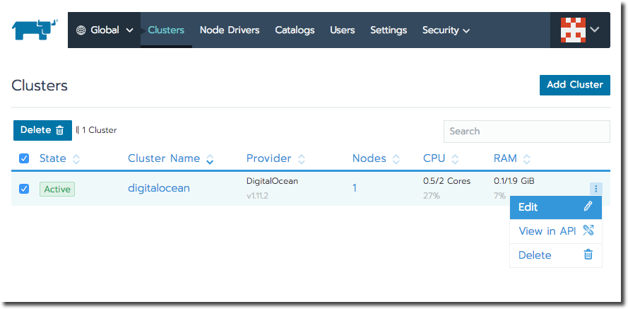
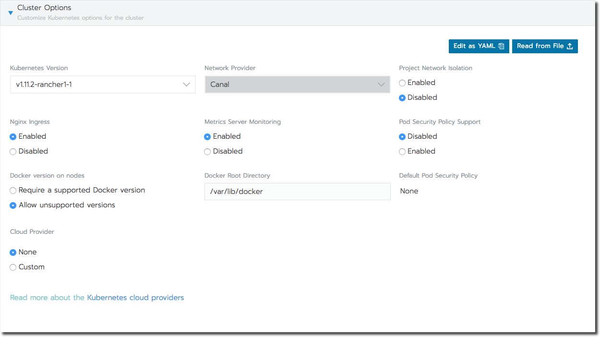
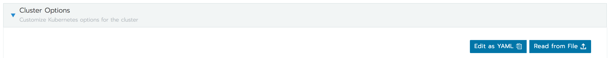

# Editing Clusters

Rancherを使用してKubernetesクラスタをプロビジョニングした後も、クラスタのオプションと設定を編集できます。
クラスターを編集するには、**グローバル**ビューを開き、**クラスター**タブが選択されていることを確認してから、編集したいクラスターの**省略記号（…）>編集**を選択します。

##### 既存のクラスタを編集する

既存のクラスタで使用可能なオプションと設定は、プロビジョニングに使用した方法によって異なります。
たとえば、[RKEによってプロビジョニングされた](https://rancher.com/docs/rancher/v2.x/en/cluster-provisioning/rke-clusters/)クラスターのみが編集可能な**クラスターオプション**を持ちます。

次の表に、各クラスタタイプで利用可能なオプションと設定を示します。

| Cluster Type | Member Roles | Cluster Options | Node Pools |
| --- | --- | --- | --- |
| [RKE-Launched](https://rancher.com/docs/rancher/v2.x/en/cluster-provisioning/#rancher-launched-kubernetes) | ✓ | ✓ | ✓ |
| [Hosted Kubernetes Cluster](https://rancher.com/docs/rancher/v2.x/en/cluster-provisioning/#hosted-kubernetes-cluster) | ✓ | | | 
| [Imported](https://rancher.com/docs/rancher/v2.x/en/cluster-provisioning/#import-existing-cluster) | ✓ | | |

## Editing Cluster Membership

クラスター管理者はクラスターのメンバーシップを編集して、どのRancherユーザーがクラスターにアクセスできるか、およびどの機能を使用できるかを制御できます。

> **pingとMS FSに関する警告：**  
> - IdPは検索や検索をサポートしていません。
> ユーザーをクラスタに追加するときは、正確なIDを正しく入力する必要があります。
> - ユーザーをクラスターに追加するとき、アクセス制御をオンにした管理者がそのグループのメンバーでない限り、グループIDはサポートされません。
> - 管理者を含むグループをクラスタに追加するときは、検索バーではなくドロップダウンから追加してください。
> 検索バーを使用してグループを追加した場合、そのグループは追加されません。

1. **グローバル**ビューから、メンバーを追加したいクラスターを開きます。

1. メインメニューから、**メンバー**を選択します。 次に**メンバーを追加**をクリックします。

1. クラスタに追加するユーザーまたはグループを探します。

    外部認証が設定されている場合：
    - Rancherは、入力時に[外部認証](https://rancher.com/docs/rancher/v2.x/en/admin-settings/authentication/)ソースからユーザーを返します。
    > ADを使用してもユーザーを見つけることができませんか？
    > 検索属性の設定に問題がある可能性があります。
    > [Active Directory認証の設定：ステップ5](https://rancher.com/docs/rancher/v2.x/en/admin-settings/authentication/ad/)を参照してください。
    - ドロップダウンを使用すると、個々のユーザーの代わりにグループを追加できます。
    ドロップダウンリストには、あなた（ログインユーザー）が属しているグループのみが一覧表示されます。
    > **Note：**  
    > ローカルユーザーとしてログインしている場合、外部ユーザーは検索結果に表示されません。 詳細については、[外部認証設定と主要ユーザ](https://rancher.com/docs/rancher/v2.x/en/admin-settings/authentication/#external-authentication-configuration-and-principal-users)を参照してください。

1. ユーザーまたはグループに**クラスタ**ロールを割り当てます。
[クラスタロールとは](https://rancher.com/docs/rancher/v2.x/en/admin-settings/rbac/cluster-project-roles/)

    > **Tip：**  
    > カスタムロールの場合は、割り当て可能な個々のロールのリストを変更できます。
    > - リストに役割を追加するには、[カスタム役割を追加](https://rancher.com/docs/rancher/v2.x/en/admin-settings/rbac/default-custom-roles/)します。
    > - リストからロールを削除するには、[ロールのロック/ロック解除](https://rancher.com/docs/rancher/v2.x/en/admin-settings/rbac/locked-roles/)をクリックします。

**結果：** 選択したユーザがクラスタに追加されます。

- クラスタメンバーシップを取り消すには、ユーザーを選択して[削除]をクリックします。
この操作により、ユーザーではなくメンバーシップが削除されます。
- クラスタ内のユーザのロールを変更するには、それらをクラスタから削除してから、変更したロールを使用してそれらを再追加します。

## Cluster Options

クラスターを編集する場合、[RKEを使用して起動された](https://rancher.com/docs/rancher/v2.x/en/cluster-provisioning/rke-clusters/)クラスターは、Kubernetesプロバイダーによってインポートまたはホストされているクラスターよりも多くのオプションがあります。
文書オプションに続く見出しは、RKEクラスターにのみ使用可能です。

### Upgrading Kubernetes

最新バージョンのRancherにアップグレードした後は、サポートされている最新バージョンのKubernetesを使用するように既存のクラスターを更新できます。
新しいバージョンのRancherがリリースされる前に、互換性を確認するために最新バージョンのKubernetesでテストされています。

> **おすすめ：**  
> Kubernetesをアップグレードする前に、[クラスタをバックアップ](https://rancher.com/docs/rancher/v2.x/en/backups/)してください。

1. **グローバル**ビューから、Kubernetesをアップグレードするクラスターを見つけます。
**Vertical Ellipsis (…) > Edit** を選択します。

1. **クラスタオプション**を展開します。

1. **Kubernetes Version**ドロップダウンから、クラスターに使用するKubernetesのバージョンを選択します。

1. **保存**をクリックします。

**結果：** Kubernetesはクラスタのアップグレードを開始します。 アップグレード中は、クラスタは利用できません。

### Adding a Pod Security Policy

クラスタがセキュリティに敏感な設定でポッドを実行しているときは、ポッドセキュリティポリシーを割り当てます。
ポッドセキュリティポリシーは、ポッドの状態と設定を監視する一連のルールです。
ポッドがポリシーで指定されているルールを満たしていない場合、ポリシーはそれを実行しないようにします。

クラスタをプロビジョニングするときにポッドセキュリティポリシーを割り当てることができます。
ただし、後でポッドのセキュリティを緩和または制限する必要がある場合は、クラスタを編集しながらポリシーを更新できます。

1. **グローバル**ビューから、ポッドセキュリティポリシーを適用するクラスタを探します。
**Vertical Ellipsis (…) > Edit** を選択します。

1. **クラスタオプション**を展開します。

1. **ポッドセキュリティポリシーサポート**から、**有効**を選択します。
    > **Note：**  
    > このオプションは、RKEによってプロビジョニングされたクラスタにのみ使用できます。

1. **デフォルトポッドセキュリティポリシー**ドロップダウンから、クラスターに適用するポリシーを選択します。
    
    Rancherには`制限付き`および`無制限`の[policies](https://rancher.com/docs/rancher/v2.x/en/admin-settings/pod-security-policies/#default-pod-security-policies)が付属していますが、[custom policiesを作成すること](https://rancher.com/docs/rancher/v2.x/en/admin-settings/pod-security-policies/#default-pod-security-policies)もできます。

1. **保存**をクリックします。

**結果：** ポッドセキュリティポリシーがクラスタおよびクラスタ内のすべてのプロジェクトに適用されます。

> **Note：**  
> ポッドセキュリティポリシーの割り当て前にすでに実行されていたワークロードは壮大です。
> ポッドセキュリティポリシーを満たしていない場合でも、ポリシーの割り当て前に実行されていたワークロードは引き続き実行されます。
>
> 実行中のワークロードがポッドセキュリティポリシーに合格しているかどうかを確認するには、クローンを作成するかアップグレードします。

### Editing Other Cluster Options

[RKEによって起動されたクラスタ](https://rancher.com/docs/rancher/v2.x/en/cluster-provisioning/rke-clusters/)では、あとに続く残りのオプションを編集できます。

> **Note：**  
> これらのオプションは、インポートされたクラスターまたはホストされたKubernetesクラスターには使用できません。

##### RKEクラスタのオプション

| Option | Description |
| --- | --- |
| Kubernetes Version | 各クラスタノードにインストールされているKubernetesのバージョン。詳しくは、[Kubernetesのアップグレード](https://rancher.com/docs/rancher/v2.x/en/k8s-in-rancher/editing-clusters/#upgrading-kubernetes)を参照してください。 |
| Network Provider | クラスタのネットワーク機能を強化する[コンテナネットワークインタフェース](https://rancher.com/docs/rancher/v2.x/en/faq/networking/#cni-providers)。  **Note：** このオプションは、クラスタのプロビジョニング中にのみ選択できます。 後で編集することはできません。 |
| Project Network Isolation | Rancher v2.0.7以降、Canalネットワークプロバイダを使用している場合は、プロジェクト間通信を有効にするか無効にするかを選択できます。 |
| Nginx Ingress | アプリケーションを高可用性構成で公開し、ネイティブのロードバランシング機能を持たないクラウドプロバイダーでノードをホストしている場合は、このオプションを有効にしてクラスター内でNginxイングレスを使用します。 |
| Metrics Server Monitoring | RKEを使用してクラスターを起動できる各クラウドプロバイダーは、メトリックを収集してクラスターノードを監視できます。 このオプションを有効にすると、クラウドプロバイダのポータルから自分のノードメトリクスが表示されます。 |
| Pod Security Policy Support | クラスタの[ポッドセキュリティポリシー](https://rancher.com/docs/rancher/v2.x/en/admin-settings/pod-security-policies/)を有効にします。 このオプションを有効にしたら、**デフォルトポッドセキュリティポリシー**ドロップダウンを使用してポリシーを選択します。 |
| Docker version on nodes | Rancherが正式にサポートしていないバージョンのDockerをノードで実行できるかどうかを構成します。[サポートされているDockerバージョン](https://rancher.com/docs/rancher/v2.x/en/installation/ha/rke-add-on/layer-7-lb/)を必要とする場合、RancherはサポートされているDockerバージョンがインストールされていないノード上でのPodの実行を停止します。 |
| Docker Root Directory | Dockerをインストールしたクラスターノード上のディレクトリ。ご使用のノードのデフォルト以外のディレクトリーにDockerをインストールする場合は、このパスを更新してください。 |
| Default Pod Security Policy | **ポッドセキュリティポリシー**のサポートを有効にした場合は、このドロップダウンを使用して、クラスターに適用されるポッドセキュリティポリシーを選択します。 |
| Cloud Provider | クラウドプロバイダーを使用してRKEによって起動されたクラスターノードをホストしている場合は、クラウドプロバイダーのネイティブ機能を使用できるようにこのオプションを有効にします。 クラウドでホストされているクラスターの永続データを保存する場合は、このオプションは必須です。 |

### Editing Cluster as YAML

> **Note：**  
> Rancher v2.0.5およびv2.0.6では、設定ファイル（YAML）内のサービスの名前にアンダースコアのみを含める必要があります。
> `kube_api` および `kube_controller` です。

Rancher UIを使用してクラスターのKubernetesオプションを選択する代わりに、上級ユーザーはRKE設定ファイルを作成できます。
設定ファイルを使用すると、RKEインストールで[利用可能なオプション](https://rancher.com/docs/rke/v0.1.x/en/config-options/)を設定することができます。

- Rancher UIからRKE設定ファイルを直接編集するには、**YAMLとして編集**をクリックします。
- 既存のRKEファイルから読み取るには、**ファイルから読み取る**をクリックします。

RKE構成ファイルの構文の例については、[RKEの資料](https://rancher.com/docs/rke/v0.1.x/en/example-yamls/)を参照してください。

## Managing Node Pools

[RKEによって起動された](https://rancher.com/docs/rancher/v2.x/en/cluster-provisioning/rke-clusters/)クラスタでは、次のことができます。

- クラスタに新しいノードプールを追加します。
プールに追加されたノードは、使用したノードテンプレートに従ってプロビジョニングされます。
    - [+]をクリックして画面の指示に従って新しいテンプレートを作成します。
    - **テンプレート**ドロップダウンからテンプレートを選択して、既存のテンプレートを再利用することもできます。

- さまざまなチェックボックスを選択して、Kubernetesロールをノードプールに再分配します。

- プール内のノード数を増減する（ただし、単にノードの増減を維持したい場合は、代わりにクラスタの[ノードタブ](https://rancher.com/docs/rancher/v2.x/en/k8s-in-rancher/nodes/#nodes-provisioned-by-node-pool)を使用することをお勧めします）。

> **Note：**  
> ノードプールセクションは、インポートされたクラスタ、またはKubernetesプロバイダによってホストされているクラスタには使用できません。

