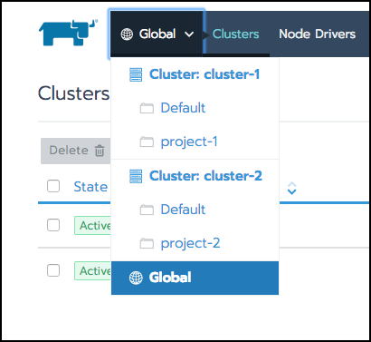

# Projects and Namespaces

## Projects

プロジェクトはRancherで導入された組織的なオブジェクトで、クラスタの管理上の負担を軽減します。
プロジェクトを使用して multi-tenancy をサポートできます。

プロジェクトは、名前空間を超えて、Kubernetesクラスタ内でのさらなるレベルの編成を提供します。
階層に関しては、

- Clusters contain projects.
- Projects contain namespaces.

Rancher内では、プロジェクトを使用すると、複数のネームスペースを単一のエンティティとして管理できます。
プロジェクトを含まない基本バージョンのKubernetesでは、ロールベースのアクセス権やクラスタリソースなどの機能が個々のネームスペースに割り当てられています。
複数のネームスペースが同じアクセス権のセットを必要とするクラスタでは、これらのアクセス権を個々のネームスペースに割り当てることは面倒になることがあります。
すべてのネームスペースに同じ権限が必要な場合でも、1回の操作でそれらの権限をすべてのネームスペースに適用することはできません。
これらの権利を各ネームスペースに繰り返し割り当てる必要があります。

Rancherプロジェクトは、プロジェクトレベルでリソースとアクセス権を適用できるようにすることでこの問題を解決します。
その後、プロジェクト内の各ネームスペースはこれらのリソースとポリシーを継承するため、それらを各ネームスペースに割り当てるのではなく、プロジェクトに一度割り当てるだけで済みます。

プロジェクトを使用して、次のような操作を実行できます。

- ユーザーに名前空間のグループへのアクセス権を割り当てます（つまり、[プロジェクトメンバーシップ](https://rancher.com/docs/rancher/v2.x/en/k8s-in-rancher/projects-and-namespaces/project-members/)）。
- プロジェクトでユーザーに特定の役割を割り当てます。 役割は、所有者、メンバー、読み取り専用、または[カスタム](https://rancher.com/docs/rancher/v2.x/en/admin-settings/rbac/default-custom-roles/)にすることができます。
- プロジェクトにリソースを割り当てます。
- ポッドセキュリティポリシーを割り当てます。

クラスターを作成すると、その中に2つのプロジェクトが自動的に作成されます。

- [Default Project](https://rancher.com/docs/rancher/v2.x/en/k8s-in-rancher/projects-and-namespaces/#default-project)
- [System Project](https://rancher.com/docs/rancher/v2.x/en/k8s-in-rancher/projects-and-namespaces/#system-project)

### Default Project

クラスターをプロビジョニングすると、クラスターのデフォルトプロジェクトが自動的に作成されます。
これは、クラスタを使い始めるために使用できるプロジェクトですが、いつでもそれを削除して、よりわかりやすい名前のプロジェクトに置き換えることができます。

## System Project
*v2.0.7から利用可能*

トラブルシューティング時に、`system` プロジェクトを表示して、Kubernetesシステムの重要なネームスペースが正しく機能しているかどうかを確認できます。
この簡単にアクセスできるプロジェクトは、個々のシステム名前空間コンテナのトラブルシューティングからあなたを救います。

開くには、**グローバル**メニューを開き、クラスタの `system` プロジェクトを選択します。

`system` プロジェクト：

- クラスターをプロビジョニングすると自動的に作成されます。
- 存在する場合は、`v3/settings/system-namespaces` に存在するすべてのネームスペースを一覧表示します。
- 名前空間を追加したり、その名前空間を他のプロジェクトに移動したりできます。
- クラスタ運用に必要なため削除できません。

> **Note：**  
> 両方のクラスタでは、
> - [Canal network plug-in](https://rancher.com/docs/rancher/v2.x/en/cluster-provisioning/rke-clusters/options/#canal) は使用中です。
> - プロジェクトネットワークの分離オプションが有効になっています。
> 
> システムプロジェクトは、他のプロジェクトと通信したり、ログを収集したり、状態をチェックしたりできるように、プロジェクトネットワークの隔離オプションをオーバーライドします。

### Authorization

管理者以外のユーザーは、管理者がプロジェクトの**メンバー**タブに明示的に追加した後にのみプロジェクトへのアクセスを許可されます。

> **例外：**  
> 管理者以外のユーザーは、自分が作成したプロジェクトにアクセスできます。

### Pod Security Policies

RancherはKubernetesを拡張して、クラスタレベルだけでなくプロジェクトレベルでも [Pod Security Policies](https://kubernetes.io/docs/concepts/policy/pod-security-policy/) を適用できるようにします。
ただし、ベストプラクティスとして、Podセキュリティポリシーをクラスタレベルで適用することをお勧めします。

### Creating Projects

1. **Global**ビューで、メインメニューから**Clusters**を選択します。
**クラスター**ページから、プロジェクトを作成したいクラスターを開きます。

1. メインメニューから**プロジェクト/ネームスペース**を選択します。
次に**プロジェクトの追加**をクリックします。

1. プロジェクト名を入力してください。

1. **オプション： Pod Security Policy** を選択します。
PSPをプロジェクトに割り当てると、次のようになります。
    - クラスタのデフォルトPSPを上書きします。
    - PSPをプロジェクトに適用します。
    - 後でプロジェクトに追加する名前空間にPSPを適用します。

    > **Note：**  
    > このオプションは、Podセキュリティポリシーをすでに作成している場合にのみ利用できます。
    > 手順については、[Podセキュリティポリシーを作成する](https://rancher.com/docs/rancher/v2.x/en/admin-settings/pod-security-policies/)を参照してください。

1. **推奨：** プロジェクトメンバーを追加してください。

    他のユーザーにプロジェクトのアクセス権と役割を提供するには、**メンバー**セクションを使用します。

    デフォルトでは、ユーザーはプロジェクトの `Owner` として追加されています。

    1. **メンバーの追加**をクリックしてください。
    1. **名前**コンボボックスから、プロジェクトアクセスを割り当てるユーザーまたはグループを探します。
        > **Note：**  
        > 外部認証が有効になっている場合にのみ、グループを検索できます。
    1. **Role**ドロップダウンから、Roleを選択します。  
    [Roleとは](https://rancher.com/docs/rancher/v2.x/en/admin-settings/rbac/cluster-project-roles/)
        > **Note：**  
        >- プロジェクトに `Owner` または `Member` の役割を割り当てられたユーザーは、`namespace creation` の役割を自動的に継承します。
        ただし、この役割は [Kubernetes ClusterRole](https://kubernetes.io/docs/reference/access-authn-authz/rbac/#role-and-clusterrole)です。
        つまり、その役割はクラスタ内のすべてのプロジェクトに及んでいます。
        そのため、プロジェクトに `Owner` または `Member` の役割を明示的に割り当てたユーザーは、`読み取り専用`の役割のみを割り当てた場合でも、自分が割り当てられている他のプロジェクトに名前空間を作成できます。
        > - その場でカスタムロールを作成するには、`Custom` を選択します。[カスタムプロジェクトロール](https://rancher.com/docs/rancher/v2.x/en/admin-settings/rbac/cluster-project-roles/#custom-project-roles)。

    1. さらにメンバーを追加するには、サブステップ1〜3を繰り返します。

1. **オプション：** プロジェクト（およびそのネームスペース）が消費できるリソースを制限する**リソース割り当て量**を追加します。
詳しくは、[リソース割り当て量](https://rancher.com/docs/rancher/v2.x/en/k8s-in-rancher/projects-and-namespaces/resource-quotas/)を参照してください。

    > **Note：**  
    > このオプションはv2.1.0以降でのみ利用可能です。

    1. **クォータの追加**をクリックします。

    1. [リソースの種類](https://rancher.com/docs/rancher/v2.x/en/k8s-in-rancher/projects-and-namespaces/resource-quotas/#resource-quota-types)を選択します。

    1. **Project Limit**と**Namespace Default Limit**の値を入力します。

        | Field | Description |
        | --- | --- |
        | Project Limit | プロジェクトの全体的なリソース制限。|
        | Namespace Default Limit | 各ネームスペースで利用可能なデフォルトのリソース制限。 この制限は、プロジェクト内の各ネームスペースに伝播されます。 すべてのプロジェクトの名前空間を合わせた制限が、プロジェクトの制限を超えてはいけません。 |

    1. **作成**をクリックします。

    **結果：** プロジェクトが作成されました。 クラスタの**Projects/Namespaces**ビューから表示できます。

## Switching Clusters/Projects

クラスタとプロジェクトを切り替えるには、メインメニューの**グローバル**ドロップダウンを使用します。

あるいは、メインメニューを使用してプロジェクトとクラスタを切り替えることもできます。

- クラスタを切り替えるには、**グローバル**ビューを開き、メインメニューから**クラスタ**を選択します。
次にクラスタを開きます。

- プロジェクトを切り替えるには、クラスタを開き、メインメニューから**Projects/Namespaces**を選択します。
開きたいプロジェクトのリンクを選択します。

## Namespaces

Rancherでは、プロジェクトをさまざまな[名前空間](https://kubernetes.io/docs/concepts/overview/working-with-objects/namespaces/)にさらに分割することができます。
これは、物理クラスタに裏打ちされたプロジェクト内の仮想クラスタです。
プロジェクトと `default` ネームスペース以外に別のレベルの組織が必要な場合は、複数のネームスペースを使用してアプリケーションとリソースを分離できます。

プロジェクト内の各ネームスペースがそれらを使用できるようにプロジェクトレベルでリソースを割り当てますが、リソースをネームスペースに明示的に割り当てることでこの継承をオーバーライドできます。

名前空間に直接割り当てることができるリソースには、次のものがあります。

- [Workloads](https://rancher.com/docs/rancher/v2.x/en/k8s-in-rancher/workloads/)
- [Load Balancers/Ingress](https://rancher.com/docs/rancher/v2.x/en/k8s-in-rancher/load-balancers-and-ingress/)
- [Service Discovery Records](https://rancher.com/docs/rancher/v2.x/en/k8s-in-rancher/service-discovery/)
- [Persistent Volume Claims](https://rancher.com/docs/rancher/v2.x/en/k8s-in-rancher/volumes-and-storage/persistent-volume-claims/)
- [Certificates](https://rancher.com/docs/rancher/v2.x/en/k8s-in-rancher/certificates/)
- [ConfigMaps](https://rancher.com/docs/rancher/v2.x/en/k8s-in-rancher/configmaps/)
- [Registries](https://rancher.com/docs/rancher/v2.x/en/k8s-in-rancher/registries/)
- [Secrets](https://rancher.com/docs/rancher/v2.x/en/k8s-in-rancher/secrets/)

> **Note：**  
> 基本バージョンのKubernetesではロールベースのアクセス権をネームスペースに割り当てることができますが、Rancherではロールをネームスペースに割り当てることはできません。
> 代わりに、プロジェクトレベルでロールベースのアクセス権を割り当てます。

### Creating Namespaces

プロジェクト内のアプリとリソースを分離するための新しい名前空間を作成します。

> **Tip：**  
> ネームスペースに割り当てることができるプロジェクトリソース（[workloads](https://rancher.com/docs/rancher/v2.x/en/k8s-in-rancher/workloads/deploy-workloads/)、[certificates](https://rancher.com/docs/rancher/v2.x/en/k8s-in-rancher/certificates/)、[ConfigMaps](https://rancher.com/docs/rancher/v2.x/en/k8s-in-rancher/configmaps/)、など）を扱う場合は、その場でネームスペースを作成できます。

1. **グローバル**ビューから、ネームスペースを作成するプロジェクトを開きます。
    > **Tip：**  
    > ベストプラクティスとして、プロジェクトレベルから名前空間を作成することをお勧めします。
    > ただし、クラスタの所有者とメンバは、クラスタレベルからも作成できます。

1. メインメニューから、**ネームスペース**を選択します。
**名前空間の追加**をクリックします。

1. **オプション：** プロジェクトに有効な[リソース割り当て](https://rancher.com/docs/rancher/v2.x/en/k8s-in-rancher/projects-and-namespaces/resource-quotas/)がある場合は、デフォルトのリソース**制限**（名前空間が消費できるリソースに上限を設ける）をオーバーライドできます。

1. **名前**を入力して**作成**をクリックします。

**結果：** あなたの名前空間がプロジェクトに追加されます。
クラスタリソースをネームスペースに割り当てることができます。

### Moving Namespaces to Another Project

別のチームにアプリケーションの使用を開始させたい場合など、クラスタ管理者およびメンバーが名前空間を別のプロジェクトに移動する必要がある場合があります。

1. **グローバル**ビューから、移動するネームスペースを含むクラスタを開きます。

1. メインメニューから**プロジェクト/ネームスペース**を選択します。

1. 別のプロジェクトに移動したいネームスペースを選択します。
次に**移動**をクリックします。
複数のネームスペースを一度に移動できます。

    > **Note：**  
    > - `System` プロジェクトの名前空間を移動しないでください。
    > これらの名前空間を移動すると、クラスタネットワークに悪影響を及ぼす可能性があります。
    > - [リソースクォータ](https://rancher.com/docs/rancher/v2.x/en/k8s-in-rancher/projects-and-namespaces/resource-quotas/)が既に構成されているプロジェクトにネームスペースを移動することはできません。
    > - クォータが設定されているプロジェクトからクォータが設定されていないプロジェクトにネームスペースを移動すると、クォータはネームスペースから削除されます。

1. 新しいネームスペース用の新しいプロジェクトを選択し、**移動**をクリックします。
あるいは、**なし**を選択して、すべてのプロジェクトからネームスペースを削除することもできます。

**結果：** 名前空間が別のプロジェクトに移動されました（またはすべてのプロジェクトから接続解除されました）。
プロジェクトリソースがネームスペースにアタッチされている場合、ネームスペースはそれらを解放してから新しいプロジェクトからアタッチされたリソースをリリースします。

### Editing Namespace Resource Quotas

プロジェクトに[リソース割り当て量](https://rancher.com/docs/rancher/v2.x/en/k8s-in-rancher/projects-and-namespaces/resource-quotas/)が設定されている場合は、名前空間のデフォルト制限を上書きして、特定の名前空間に、より多くの（または少ない）プロジェクトリソースへのアクセス権を付与できます。

1. **グローバル**ビューから、リソースクォータを編集するネームスペースを含むクラスタを開きます。

1. メインメニューから**プロジェクト/ネームスペース**を選択します。

1. リソース割り当て量を編集するネームスペースを探します。
`Ellipsis (…) > Edit`を選択します。

1. リソース割り当て**制限**を編集します。
これらの制限により、ネームスペースで利用可能なリソースが決まります。
制限は、構成された[プロジェクト制限](https://rancher.com/docs/rancher/v2.x/en/k8s-in-rancher/projects-and-namespaces/resource-quotas/#project-limits)内に設定する必要があります。

    **各リソースタイプ**の詳細については、[リソース割り当てタイプ](https://rancher.com/docs/rancher/v2.x/en/k8s-in-rancher/projects-and-namespaces/resource-quotas/#resource-quota-types)を参照してください。

    > **Note：**  
    > - プロジェクトにリソース割り当てが設定されていない場合、これらのオプションは使用できません。
    > - 設定したプロジェクト制限を超える制限を入力した場合、Rancherは編集内容を保存させません。

**結果：** 名前空間のデフォルトのリソース割り当て量が、上書きによって上書きされます。

