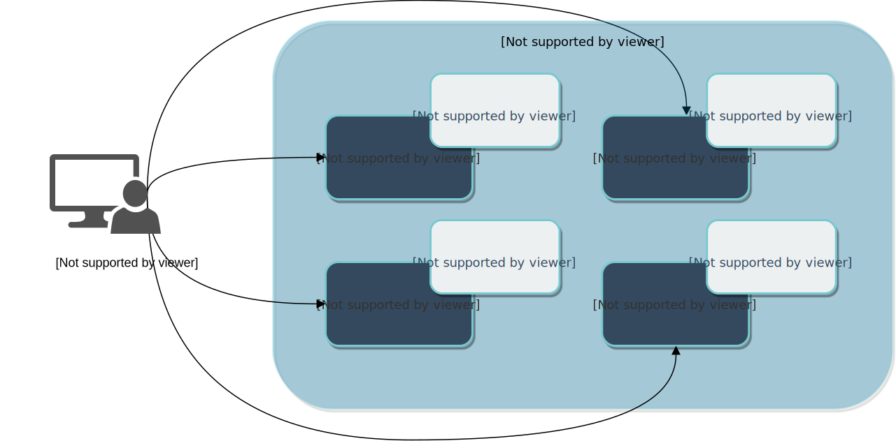
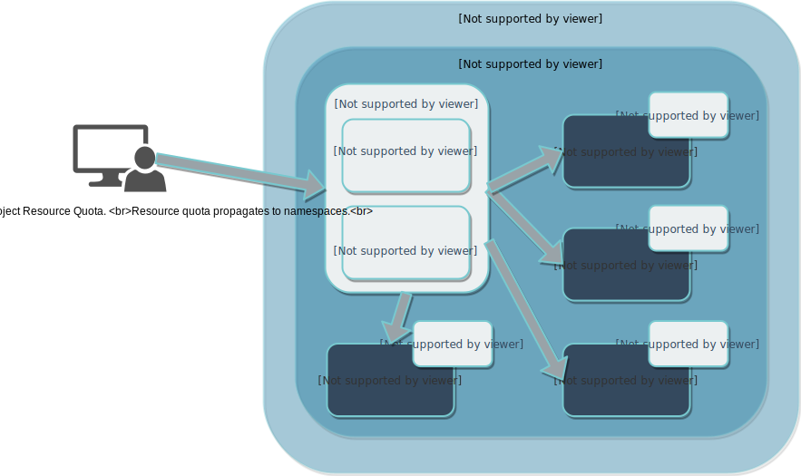
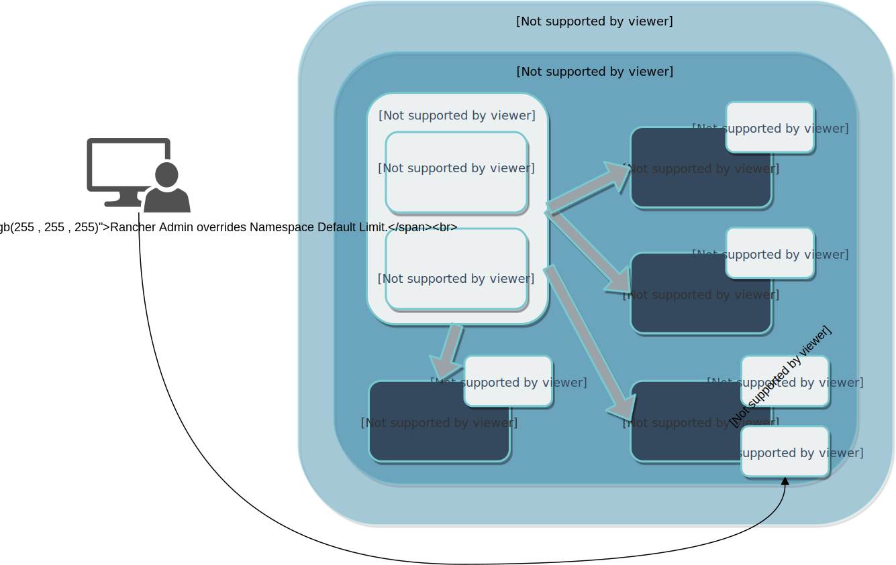

# Resource Quotas

*v2.1.0から利用可能*

複数のチームがクラスタを共有している状況では、1つのチームが使用可能なリソース（CPU、メモリ、ストレージ、サービス、ポッドや秘密などのKubernetesオブジェクトなど）を過剰に消費する可能性があります。
この過剰消費を防ぐために、リソース割り当て量を適用できます。
これは、プロジェクトまたはネームスペースで使用可能なリソースを制限するRancherの機能です。

## Resource Quotas in Rancher(Rancherのリソース割り当て)

Rancherのリソースクォータには、[Kubernetesのネイティブバージョン](https://kubernetes.io/docs/concepts/policy/resource-quotas/)と同じ機能が含まれています。
ただし、Rancherでは、[プロジェクト](https://rancher.com/docs/rancher/v2.x/en/k8s-in-rancher/projects-and-namespaces/#projects)にリソース割り当てを適用できるようにリソース割り当てが拡張されています。

標準のKubernetes展開では、リソースクォータは個々のネームスペースに適用されます。
ただし、1回の操作でクォータをネームスペースに同時に適用することはできません。
代わりに、リソース割り当て量を複数回適用する必要があります。

次の図では、Kubernetes管理者がRancherなしでリソース割り当てを強制しようとしています。
管理者は、クラスタ内のすべてのネームスペース（`Namespace 1-4`）に同じCPUとメモリの制限を設定するリソースクォータを適用したいと考えています。
ただし、Kubernetesの基本バージョンでは、ネームスペースごとに固有のリソース割り当てが必要です。 管理者は、同じスペックを設定した4つの異なるリソースクォータ（`Resource Quota 1-4`）を作成し、それらを個別に適用する必要があります。

###### 基本Kubernetes：各名前空間に適用されている一意のリソース割り当て

リソース割り当て量は、Rancherでは少し異なります。
Rancherでは、[プロジェクト](https://rancher.com/docs/rancher/v2.x/en/k8s-in-rancher/projects-and-namespaces/#projects)にリソースクォータを適用し、クォータが各ネームスペースに伝播されます。
その後、Kubernetesはネイティブバージョンのリソースクォータを使用して制限を適用します。
特定のネームスペースのクォータを変更したい場合は、[それを上書き](https://rancher.com/docs/rancher/v2.x/en/k8s-in-rancher/projects-and-namespaces/resource-quotas/#namespace-default-limit-overrides)できます。

リソース割り当てには、プロジェクトの作成または編集中に設定した2つの制限があります。

- **プロジェクトの制限：**

    この一連の値は、プロジェクトの全体的なリソース制限を構成します。
    プロジェクトに新しいネームスペースを追加しようとすると、Rancherはプロジェクトにネームスペースを収容するのに十分なリソースがあることを検証するために設定した制限を使用します。
    つまり、リソースクォータの近くでプロジェクトにネームスペースを追加しようとすると、Rancherはネームスペースの追加をブロックします。

- **ネームスペースのデフォルト制限：**

    この値は、各ネームスペースで使用可能なデフォルトのリソース制限です。
    プロジェクトは各ネームスペースに制限を伝播します。
    上書きしない限り、各ネームスペースはこのデフォルト制限にバインドされます。

次の図では、Rancher管理者は、プロジェクト内のすべてのネームスペース（`Namespace 1-4`）に同じCPUとメモリの制限を設定するリソースクォータを適用したいと考えています。
ただし、Rancherでは、管理者は個々のネームスペースではなく、プロジェクトのリソースクォータ（`Project Resource Quota`）を設定できます。
このクォータには、プロジェクト全体（`Project Limit`）と個々のネームスペース（`Namespace Default Limit`）の両方に対するリソース制限が含まれています。
次に、Rancherはこのクォータを各ネームスペースに伝播します（`Namespace Resource Quota`）。

##### Rancher：各名前空間に伝播するリソース割り当て

次の表は、2つのクォータタイプの主な違いについて説明しています。

| Rancher Resource Quotas | Kubernetes Resource Quotas |
| --- | --- |
| プロジェクトと名前空間に適用されます。 | ネームスペースにのみ適用されます。 |
| プロジェクト内のすべてのネームスペースにリソースプールを作成します。 | 個々のネームスペースに静的なリソース制限を適用します。 |
| 伝播によって名前空間にリソース割り当てを適用します。 | 割り当てられたネームスペースにのみ適用されます。 |

## Creating Resource Quotas(リソース割り当て量の作成)

以下のコンテキストでリソースクォータを作成できます。

- [プロジェクト作成中](https://rancher.com/docs/rancher/v2.x/en/k8s-in-rancher/projects-and-namespaces/#creating-projects)
- [プロジェクト編集中](https://rancher.com/docs/rancher/v2.x/en/k8s-in-rancher/projects-and-namespaces/editing-projects/#editing-resource-quotas)

## Resource Quota Types(リソース割り当てタイプ)

リソースクォータを作成すると、プロジェクトで利用可能なリソースのプールが構成されます。
以下のリソースタイプに対して、以下のリソース制限を設定できます。

| Resource Type | Description |
| --- | --- |
| CPU Limit | プロジェクト/名前空間に割り当てられているCPUの最大量（[ミリコア](https://kubernetes.io/docs/concepts/configuration/manage-compute-resources-container/#meaning-of-cpu)単位）。1) |
| CPU Reservation | プロジェクト/名前空間に保証されている最小CPU量（ミリコア単位）。1) |
| Memory Limit | プロジェクト/名前空間に割り当てられる最大メモリ量（バイト単位）。1) |
| Memory Reservation | プロジェクト/名前空間に保証されている最小メモリ量（バイト単位）。1) |
| Storage Reservation | プロジェクト/名前空間に保証されている最小ストレージ量（ギガバイト単位）。 |
| Services Load Balancers | プロジェクト/ネームスペースに存在できるロードバランサーサービスの最大数。 |
| Services Node Ports | プロジェクト/ネームスペースに存在できるノードポートサービスの最大数。 |
| Pods | プロジェクト/ネームスペースに非終端状態で存在できるポッドの最大数（つまり、`（Failed、Succeeded）の状態が.status.phase`でtrueに等しいポッド）。 |
| Services | プロジェクト/ネームスペースに存在できるサービスの最大数。 |
| ConfigMaps | プロジェクト/ネームスペースに存在できるConfigMapの最大数。 |
| Persistent Volume Claims | プロジェクト/名前空間に存在できる永続的なボリューム要求の最大数。 |
| Replications Controllers | プロジェクト/ネームスペースに存在できるレプリケーションコントローラの最大数。 |
| Secrets | プロジェクト/名前空間に存在できる秘密の最大数。 |

> **1)：**  
> クォータで、CPUまたはメモリの制限を設定した場合は、プロジェクト/ネームスペースに作成したすべてのコンテナが明示的にクォータを満たす必要があります。
> 詳細はKubernetesのドキュメントを参照してください。

### Overriding the Default Limit for a Namespace

**名前空間のデフォルト制限**はプロジェクトから各名前空間に反映されますが、場合によっては、特定の名前空間のパフォーマンスを上げる（または下げる）必要があります。
この場合は、ネームスペースを編集してデフォルトの制限を上書きできます。

下の図では、Rancher管理者は自分のプロジェクトに有効なリソース割り当てを持っています。 ただし、管理者は、 `Namespace 3` のネームスペース制限を上書きしてパフォーマンスを向上させる必要があります。
したがって、管理者は、ネームスペースがより多くのリソースにアクセスできるように、`Namespace 3` の[ネームスペース制限を引き上げ](https://rancher.com/docs/rancher/v2.x/en/k8s-in-rancher/projects-and-namespaces/#editing-namespace-resource-quotas)ます。

##### ネームスペースのデフォルト制限の上書き

方法：[名前空間のリソース割り当てを編集する](https://rancher.com/docs/rancher/v2.x/en/k8s-in-rancher/projects-and-namespaces/#editing-namespace-resource-quotas)

