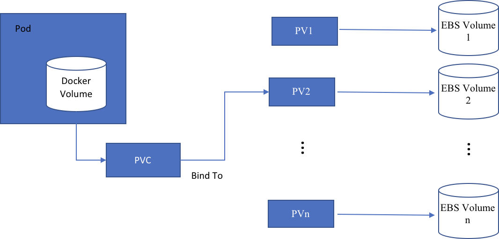
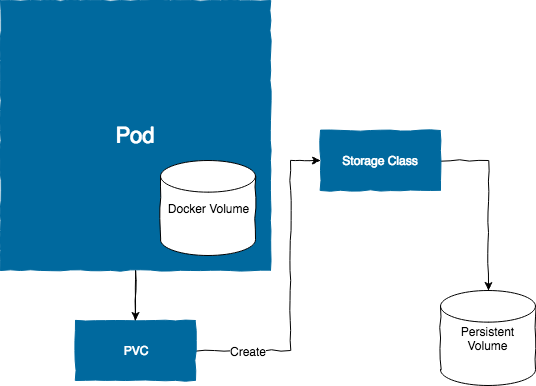
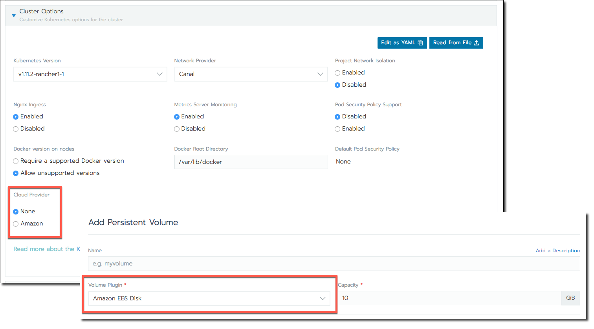

# Volumes and Storage

データを保持する必要があるアプリケーションをデプロイするときは、永続ストレージを作成する必要があります。
永続ストレージを使用すると、アプリケーションを実行しているポッドの外部にアプリケーションデータを保存できます。
この保存方法により、アプリケーションのポッドが失敗した場合でも、アプリケーションデータを維持できます。

Kubernetesで永続ストレージを作成する方法は2つあります。
永続ボリューム（PV）とストレージクラスです。

## Persistent Volumes(永続的ボリューム)

固定ボリュームは、後でポッドにバインドできる事前プロビジョニングされたストレージボリュームです。
事前にプロビジョニングされた各ボリュームは、Kubernetes永続ボリュームに対応しています。
アプリケーションを起動すると、永続ボリュームにバインドする永続ボリューム要求（PVC）が作成されます。
PVCはDockerボリュームに対応します。
各PVCは、PVCが必要とする最小リソースを含む1つのPVにバインドされます。
次の図は、ポッド、PVC、PV、および基盤となるクラウドストレージの間の関係を示しています。



Rancherでは、クラスタレベルでPVを作成し、後でそれらをPVCにバインドすることができます。
ボリュームはプロジェクトごとに管理されます。

## Storage Classes

ストレージクラスを使用すると、最初にPVを作成しなくても、PVCを動的に作成できます。
たとえば、Amazon EBSストレージクラスはEBSボリュームを動的に作成し、それらをPVCにバインドします。
ストレージクラスは、ストレージドライバの概念に似ています。
次の図は、PVCの作成によって基盤となるEBSボリュームの動的プロビジョニングがどのように開始されるかを示しています。



### Storage and Cloud Providers

[RKEによって起動された](https://rancher.com/docs/rancher/v2.x/en/cluster-provisioning/rke-clusters/)クラスターの永続ストレージをプロビジョニングするときは、クラスターをホストするプロバイダーと同じプロバイダーを使用してストレージをホストする必要があります。
たとえば、Amazon EC2でクラスターをホストしている場合は、ストレージをAmazon EBSでホストする必要があります。
RKEで起動したクラスターのストレージを設定するには、2つのタスクを実行する必要があります。
クラスターの**クラウドプロバイダー**オプションを有効にすることと、同じプロバイダーを使用してストレージを追加することです。

###### クラウドプロバイダオプションの有効化/ストレージプロバイダの選択



RKEによって起動されたクラスターのストレージをセットアップする前に、そのクラスターの**クラウドプロバイダー**オプションが有効になっていることを確認してください。
[クラウドプロバイダ](https://rancher.com/docs/rancher/v2.x/en/cluster-provisioning/rke-clusters/options/cloud-providers/)は、Rancherのプロバイダの機能（永続ストレージのプロビジョニングなど）を使用できるようにするモジュールです。

次の2つの状況のいずれかでクラウドプロバイダオプションを有効にできます。

- [クラスタをプロビジョニングするとき](https://rancher.com/docs/rancher/v2.x/en/cluster-provisioning/)
- [クラスタを編集するとき](https://rancher.com/docs/rancher/v2.x/en/k8s-in-rancher/editing-clusters/)

[永続ボリューム](https://rancher.com/docs/rancher/v2.x/en/k8s-in-rancher/volumes-and-storage/#adding-persistent-volumes)または[ストレージクラス](https://rancher.com/docs/rancher/v2.x/en/k8s-in-rancher/volumes-and-storage/#adding-storage-classes)の設定を開始するときに、クラウドプロバイダのストレージプラグインまたはプロビジョニングプログラムを選択できます。

#### Storage Classes and Cloud Providers

さらに、ストレージクラスには、クラウドプロバイダ向けのいくつかの追加設定があります。

各ストレージクラスには、フィールド `provisioner`、`parameters`、および `reclaimPolicy` が含まれています。
これらは、クラスに属する永続ボリュームを動的にプロビジョニングする必要がある場合に使用されます。

`provisioner` は、永続ボリュームのプロビジョニングに使用されるボリュームプラグインを決定します。

##### Supported Storage Class Provisioners(サポートされているストレージクラスプロビジョニングツール)

- Amazon EBS Disk
- AzureFile
- AzureDisk
- Ceph RBD
- Gluster Volume
- Google Persistent Disk
- Longhorn
- Openstack Cinder Volume
- Portworx Volume
- Quobyte Volume
- ScaleIO Volume
- StorageOS
- Vmware vSphere Volume

ストレージクラスの各プロビジョニング担当者のオプションをカスタマイズすることに加えて、ボリューム `reclaimPolicy` を定義することもできます。
利用可能な2つのオプションがあります。

- ワークロードによって解放されたときにボリュームと基礎となるデバイスを削除します。
- 手動クリーンアップ用にボリュームを保持します。

最後に、作成した永続ボリュームに対してカスタムの `MountOption` を定義できます。

`parameters` は各クラウドストレージプロビジョニング担当者に固有です。
ストレージクラスプロビジョニングパラメータの詳細については、公式の [Kubernetesのドキュメント](https://kubernetes.io/docs/concepts/storage/storage-classes/#parameters) を参照してください。

### Adding Persistent Volumes

あなたのコンテナは自分自身でデータを保存することができますが、コンテナが失敗すると、そのデータは失われます。
この問題を解決するために、Kubernetesは永続的なボリュームを提供しています。
これはあなたのコンテナがアクセスできる外部ストレージディスクまたはファイルシステムです。
コンテナーがクラッシュした場合、その置換コンテナーはデータを失うことなく永続ボリューム内のデータにアクセスできます。

固定ボリュームは、オンプレミスでホストするディスクまたはファイルシステムのいずれかにすることも、Amazon EBSやAzure Diskなどのベンダーによってホストすることもできます。

> 前提条件：  
> - Permissions：`Manage Volumes` [role](https://rancher.com/docs/rancher/v2.x/en/admin-settings/rbac/cluster-project-roles/#project-role-reference)
> - [ストレージをプロビジョニングしておく](https://rancher.com/docs/rancher/v2.x/en/k8s-in-rancher/volumes-and-storage/examples/)必要があります。
> - クラウドでホストされているクラスターのストレージをプロビジョニングする場合は、次の手順を実行します。
>   - ストレージホストとクラスタホストは[同じプロバイダ](https://rancher.com/docs/rancher/v2.x/en/k8s-in-rancher/volumes-and-storage/#storage-and-cloud-providers)である必要があります。
>   - [クラウドプロバイダー](https://rancher.com/docs/rancher/v2.x/en/cluster-provisioning/rke-clusters/options/cloud-providers/)オプションを有効にする必要があります。

1. **グローバル**ビューから、永続的ボリュームストレージを追加するコンテナを実行しているクラスタを開きます。

1. メインメニューから、**Storage> Persistent Volumes** の順に選択します。

1. **ボリュームの追加**をクリックします。

1. 固定ボリュームの**名前**を入力します。

1. 使用しているディスクの種類またはサービスに対応する**ボリュームプラグイン**を選択します。

    > **Note：**  
    > クラウドプロバイダーによってホストされているクラスターにストレージを追加する場合：
    > - クラスターの[クラウドプロバイダー](https://rancher.com/docs/rancher/v2.x/en/cluster-provisioning/rke-clusters/options/cloud-providers/)オプションを有効にする必要があります。
    > - クラウドストレージにはクラウドプロバイダーのプラグインを使用する必要があります。
    > たとえば、Amazon EC2クラスターがあり、それにクラウドストレージを使用する場合は、次のようにします。
    >   - EC2クラスターの `cloud provider` オプションを有効にする必要があります。
    >   - `Amazon EBS Disk` ボリュームプラグインを使用する必要があります。

1. ボリュームの**容量**をギガバイト単位で入力します。

1. **プラグイン設定**フォームに記入してください。
各プラグインタイプには、ディスクタイプの製造元に固有の情報が必要です。
各プラグインのフォームと必要な情報に関するヘルプについては、プラグインのベンダーのドキュメントを参照してください。

1. **オプション：カスタマイズ**フォームに入力します。
このフォームの特徴：

    - [Access Modes](https://kubernetes.io/docs/concepts/storage/persistent-volumes/#access-modes):  
        このオプションは、ノードの読み取り/書き込み権限とともに、ボリュームにアクセスできるノード数を設定します。
        [Kubernetesのドキュメント](https://kubernetes.io/docs/concepts/storage/persistent-volumes/#access-modes)には、利用可能なプラグインがどのアクセスモードをサポートしているかを一覧にした表があります。
    - [Mount Options](https://kubernetes.io/docs/concepts/storage/persistent-volumes/#mount-options)：
        各ボリュームプラグインを使用すると、マウントプロセス中に追加のコマンドラインオプションを指定できます。
        これらのオプションは**マウントオプション**フィールドに入力できます。
        利用可能なマウントオプションについては、各プラグインのベンダーのドキュメントを参照してください。
    - **Assign to Storage Class**：
        後でここで指定したボリュームと同一の永続ボリュームを自動的にプロビジョニングする場合は、それにストレージクラスを割り当てます。
        後で、ワークロードを作成するときに、ストレージクラスを参照する永続的なボリュームの要求を割り当てることができます。
        これにより、ここで指定したボリュームと同一の永続的なボリュームがプロビジョニングされます。

    > **Note：**  
    > 永続クラスに割り当てる前に、[ストレージクラスを追加する](https://rancher.com/docs/rancher/v2.x/en/k8s-in-rancher/volumes-and-storage/#adding-storage-classes)必要があります。

1. 保存をクリックします。

**結果：** 新しい固定ボリュームが作成されます。

### Adding Storage Classes

ストレージクラスを使用すると、永続ボリュームをオンデマンドで動的にプロビジョニングできます。
ストレージクラスは、要求時に自動的に作成されるストレージプロファイルと見なします（これは、永続的なボリューム要求と呼ばれます）。

> **前提条件：**  
> - Permissions： `Manage Volumes` [role](https://rancher.com/docs/rancher/v2.x/en/admin-settings/rbac/cluster-project-roles/#project-role-reference)
> - [ストレージをプロビジョニングしておく](https://rancher.com/docs/rancher/v2.x/en/k8s-in-rancher/volumes-and-storage/examples/)必要があります。
> - クラウドでホストされているクラスターのストレージをプロビジョニングする場合は、次の手順を実行します。
>   - ストレージホストとクラスタホストは[同じプロバイダ](https://rancher.com/docs/rancher/v2.x/en/k8s-in-rancher/volumes-and-storage/#storage-and-cloud-providers)である必要があります。
>   - [クラウドプロバイダー](https://rancher.com/docs/rancher/v2.x/en/cluster-provisioning/rke-clusters/options/cloud-providers/)オプションを有効にする必要があります。

1. **グローバル**ビューから、永続ストレージボリュームを動的にプロビジョニングするクラスタを開きます。

1. メインメニューから、`Storage> Storage Classes` の順に選択します。
`クラスの追加`をクリックします。

1. ストレージクラスの`名前`を入力してください。

1. `Provisioner` ドロップダウンから、ストレージボリュームを動的にプロビジョニングするために使用するサービスを選択します。

    > **Note：**  
    > ストレージクラスを追加するクラスターがクラウドストレージも提供するクラウドサービスである場合は、クラスターの`クラウドプロバイダー`オプションを有効にし、クラウドストレージを使用するにはサービスのプラグインを使用する必要があります。
    > たとえば、Amazon EC2クラスターがあり、それにクラウドストレージを使用する場合は、次のようにします。
    > - EC2クラスターの`クラウドプロバイダー`オプションを有効にする必要があります。
    > - `Amazon EBS Disk`プロビジョニングツールを使用する必要があります。

1. `パラメータ`セクションから、サービスがストレージボリュームを動的にプロビジョニングするために必要な情報を記入します。
各プロビジョニング担当者は、ストレージボリュームを動的に準備するために異なる情報を必要とします。
この情報を取得する方法については、サービスのマニュアルを参照してください。

1. `保存`をクリックします。

## iSCSI Volumes With Rancher Launched Kubernetes Clusters

iSCSIボリュームにデータを格納する[Rancher Launched Kubernetesクラスタ](https://rancher.com/docs/rancher/v2.x/en/cluster-provisioning/rke-clusters/)では、kubeletがiSCSIボリュームに自動的に接続できないという問題が発生する可能性があります。
この失敗は、iSCSIイニシエーターツールに関する非互換性の問題が原因である可能性があります。
この問題を解決するには、各クラスタノードにiSCSIイニシエータツールをインストールします。

iSCSIボリュームにデータを格納するRancher Launchを開始したKubernetesクラスターは、kubeletの `rancher/hyperkube` Dockerイメージに組み込まれている [iSCSIイニシエーターツール](http://www.open-iscsi.com/)を利用します。
各キューブレット（すなわち、イニシエータ）から、ツールは、iSCSIボリューム（すなわち、ターゲット）とのセッションを発見し起動する。
ただし、場合によっては、イニシエータとターゲットにインストールされているiSCSIイニシエータツールのバージョンが一致せず、接続が失敗することがあります。

この問題が発生した場合は、クラスタ内の各ノードにイニシエータツールをインストールすることで回避できます。
iSCSIイニシエータツールをインストールするには、クラスタノードにログインして次のいずれかのコマンドを入力します。

| Platform | Package Name | Install Command |
| --- | --- | --- |
| Ubuntu/Debian | `open-iscsi` | sudo apt install open-iscsi |
| RHEL | `iscsi-initiator-utils` | yum install iscsi-initiator-utils -y |

ノードにイニシエータツールをインストールしたら、次のサンプルに示すように、クラスタのYAMLを編集し、kubelet設定を編集してiSCSIバイナリと設定をマウントします。

> **Note：**  
> iSCSIバイナリと設定をマウントするようにKubernetes YAMLを更新する前に、`open-iscsi`（deb）または `iscsi-initiator-utils`（yum）パッケージがクラスタノードにインストールされていることを確認してください。
> Kubernetes YAMLでバインドマウントが作成される前にこのパッケージがインストールされていない場合、Dockerは各ノードにディレクトリとファイルを自動的に作成し、パッケージのインストールを成功させることはできません。

```
services:
  kubelet:
    extra_binds:
      - "/etc/iscsi:/etc/iscsi"
      - "/sbin/iscsiadm:/sbin/iscsiadm"
```

## What’s Next?

アプリケーションがデータを保存できるように、Persistent Volumeをワークロードにマウントします。
手動で作成された永続ボリューム、またはストレージクラスから作成された動的に作成された永続ボリュームをマウントできます。

Persistent Volumeは、2つのうちのどちらかのコンテキストでマウントできます。

- ワークロードの展開中（可能であれば推奨） 詳しくは、[ワークロードのデプロイ](https://rancher.com/docs/rancher/v2.x/en/k8s-in-rancher/workloads/deploy-workloads/)を参照してください。

- ワークロード作成後 詳細については、[永続的ボリューム要求を追加する](https://rancher.com/docs/rancher/v2.x/en/k8s-in-rancher/volumes-and-storage/persistent-volume-claims/)を参照してください。


## Related Links

- [Kubernetes Documentation: Storage](https://kubernetes.io/docs/concepts/storage/)


