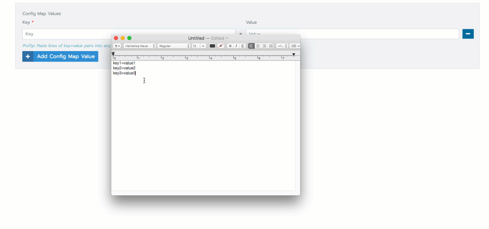

# ConfigMaps

ほとんどの種類のKubernetes機密は機密情報を格納しますが、[ConfigMaps](https://kubernetes.io/docs/tasks/configure-pod-container/configure-pod-configmap/)は構成ファイルのグループなどの一般的な構成情報を格納します。
ConfigMapsは機密情報を保存しないため、自動的に更新することができ、したがって更新後にコンテナを再起動する必要がありません（手動更新とコンテナの再起動が必要なほとんどのシークレットタイプとは異なります）。

ConfigMapは、設定ファイルやJSON BLOBなどの一般的な文字列形式のキーと値のペアを受け入れます。
設定マップをアップロードした後は、どのワークロードでもそれを環境変数またはボリュームマウントとして参照できます。

> **Note：**  
> ConfigMapsは[名前空間](https://rancher.com/docs/rancher/v2.x/en/k8s-in-rancher/projects-and-namespaces/#namespaces)内でのみ利用可能で[プロジェクト](https://rancher.com/docs/rancher/v2.x/en/k8s-in-rancher/projects-and-namespaces/#projects)では利用できません。
> （https://rancher.com/docs/rancher/v2.x/en/k8s-in-rancher/projects-and-namespaces/#namespaces）ConfigMapsには、設定ファイル、コマンドなどのアプリケーションの一般的な設定情報が格納されています。
> 行引数、環境変数など。ConfigMapは、設定ファイルやJSON BLOBなどの一般的な文字列形式のキーと値のペアを受け入れます。
> ConfigMapsをRancherワークスペースに追加して、後でそれらをワークロードに追加できるようにします。 
> ConfigMapsの詳細については、公式の[Kubernetes Documentation：Using ConfigMap](https://kubernetes-v1-4.github.io/docs/user-guide/configmap/)を参照してください。
> 
> **Note：**  
> ConfigMapsは名前空間にのみ適用でき、プロジェクトには適用できません。

1. **グローバル**ビューから、ConfigMapを追加したいネームスペースを含むプロジェクトを選択します。

1. メインメニューから、**Resources > Config Maps** の順に選択します。
**Add Config Map**をクリックします。

1. 設定マップの**名前**を入力します。

    > **Note：**  
    > KubernetesはConfigMapsを機密として分類し、プロジェクトまたは名前空間内の2つの機密が重複する名前を持つことはできません。
    > したがって、競合を防ぐために、ConfigMapsは、ワークスペース内の他の証明書、ConfigMaps、レジストリー、および機密情報の中で固有の名前を持つ必要があります。

1. 設定マップを追加する**ネームスペース**を選択します。
**新しいネームスペースに追加**をクリックして、新しいネームスペースをその場で追加することもできます。

1. **Config Map Values**から、**Config Map Valuesの追加**をクリックして、キーと値のペアを構成マップに追加します。
必要なだけ多くの値を追加してください。

1. **保存**をクリックします。

    > **Note：**  
    > [秘密を使用して機密データ](https://rancher.com/docs/rancher/v2.x/en/k8s-in-rancher/secrets/)を保存するためにConfigMapsを使用しないでください。
    > **Tip：**
    > コピーして貼り付けることで、ConfigMapに複数のキーと値のペアを追加できます。
    > 
    > 

**結果：** ConfigMapがネームスペースに追加されます。 Rancher UIの **Resources> Config Maps**ビューから表示できます。

## What’s Next?

ConfigMapをネームスペースに追加したので、それを元のネームスペースからデプロイするワークロードに追加できます。
ConfigMapを使用して、アプリケーションが使用する情報を次のように指定できます。

- アプリケーション環境変数
- ワークロードにマウントされているボリュームのパラメーターの指定

ワークロードへのConfigMapの追加の詳細については、[ワークロードのデプロイ](https://rancher.com/docs/rancher/v2.x/en/k8s-in-rancher/workloads/deploy-workloads/)を参照してください。

