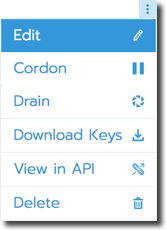
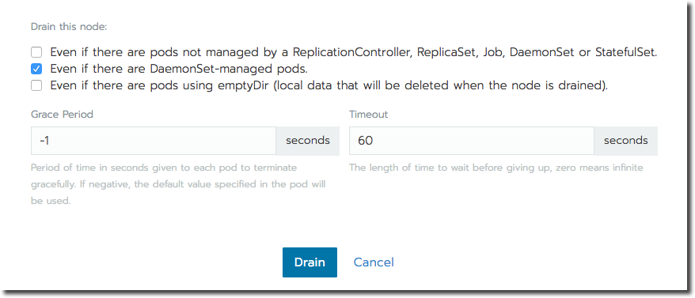
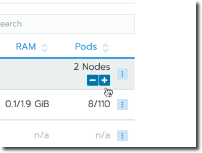

# Nodes

RancherでKubernetesクラスタを起動したら、クラスタの**ノード**タブから個々のノードを管理できます。
クラスタのプロビジョニングに[使用されたオプション](https://rancher.com/docs/rancher/v2.x/en/cluster-provisioning/#cluster-creation-in-rancher)に応じて、利用可能なノードオプションが異なります。

個々のノードを管理するには、管理したいクラスターを参照してから、メインメニューから**ノード**を選択します。
**省略記号**アイコン（…）をクリックすると、ノードのオプションメニューを開くことができます。



> **Note：**  
> 個々のノードではなくクラスタを管理したい場合は、[クラスタの編集](https://rancher.com/docs/rancher/v2.x/en/k8s-in-rancher/editing-clusters/)を参照してください。

次の表は、Rancherの[各タイプのクラスター](https://rancher.com/docs/rancher/v2.x/en/cluster-provisioning/#cluster-creation-options)に使用できるノードオプションを示しています。
各機能の詳細については、**オプション**列のリンクをクリックしてください。

| Option | [Nodes Hosted by an Infrastructure Provider](https://rancher.com/docs/rancher/v2.x/en/cluster-provisioning/rke-clusters/node-pools/) | [Custom Node](https://rancher.com/docs/rancher/v2.x/en/cluster-provisioning/rke-clusters/custom-nodes/) | [Hosted Cluster](https://rancher.com/docs/rancher/v2.x/en/cluster-provisioning/hosted-kubernetes-clusters/) | [Imported Nodes](https://rancher.com/docs/rancher/v2.x/en/cluster-provisioning/imported-clusters/)　| Description |
| --- | --- | --- | --- | --- | --- |
| [Cordon](https://rancher.com/docs/rancher/v2.x/en/k8s-in-rancher/nodes/#cordoning-a-node) | ゝ | ゝ | ゝ | | ノードをスケジュール不能としてマークします。 |
| [Drain](https://rancher.com/docs/rancher/v2.x/en/k8s-in-rancher/nodes/#draining-a-node) | ゝ | ゝ | ゝ | | ノードに未確定のマークを付け、すべてのポッドを削除します。 |
| [Edit](https://rancher.com/docs/rancher/v2.x/en/k8s-in-rancher/nodes/#editing-a-node) | ゝ | ゝ | ゝ | | ノードのカスタムの名前、説明、またはラベルを入力します。 |
| [View API](https://rancher.com/docs/rancher/v2.x/en/k8s-in-rancher/nodes/#viewing-a-node-api) | ゝ | ゝ | ゝ | | APIデータを表示します。 |
| [Delete](https://rancher.com/docs/rancher/v2.x/en/k8s-in-rancher/nodes/#deleting-a-node) | ゝ | ゝ | | | クラスタから欠陥のあるノードを削除します。 |
| [Download Keys](https://rancher.com/docs/rancher/v2.x/en/k8s-in-rancher/nodes/#remoting-into-a-node-pool-node) | ゝ | | | | ノードにリモート処理するためのSSHキーをダウンロードします。 |
| [Node Scaling](https://rancher.com/docs/rancher/v2.x/en/k8s-in-rancher/nodes/#scaling-nodes) | ゝ | | | | ノードプール内のノード数を増減します。 |

## Cordoning a Node

ノードをコーディネーションすると、そのノードはスケジュール不可能とマークされます。
この機能は、再起動、アップグレード、廃止など、小さなメンテナンス期間中にノードで短いタスクを実行するのに役立ちます。
完了したら、電源を入れ直し、ノードの割り当てを解除してノードを再びスケジュール可能にします。

## Draining a Node

排水は、最初にノードをコード化し、次にそのすべてのポッドを削除するプロセスです。
この機能は、ノードのメンテナンス（カーネルのアップグレードやハードウェアのメンテナンスなど）を実行するのに役立ちます。
既存のポッドを再配布している間に新しいポッドがノードにデプロイされるのを防ぎ、ユーザーがサービスを中断しないようにします。

- レプリカセットを持つポッドの場合、ポッドは新しいノードにスケジュールされる新しいポッドに置き換えられます。
さらに、ポッドがサービスの一部である場合、クライアントは自動的に新しいポッドにリダイレクトされます。

- レプリカが設定されていないポッドの場合は、ポッドの新しいコピーを起動する必要があります。
ポッドがサービスの一部ではないと想定して、クライアントをそのポッドにリダイレクトします。

`コードオン`状態または`アクティブ`状態にあるノードを排出することができます。
あなたがノードを排水すると、そのノードは閉鎖され、それらが排水されるために満たさなければならない条件についてノードが評価され、そして（それが条件を満たす場合）ノードはそのポッドを追い出す。

ただし、排水を開始したときに排出される条件を無効にすることができます（[下記](https://rancher.com/docs/rancher/v2.x/en/k8s-in-rancher/nodes/#below)参照）。
猶予期間とタイムアウト値を設定する機会もあります。



次のリストは各排水オプションを説明したものです。

- **ReplicationController、ReplicaSet、Job、DaemonSet、またはStatefulSetによって管理されていないポッドがある場合でも**

    これらの種類のポッドはコントローラーを持っていないので、新しいノードにスケジュール変更されることはありません。
    Kubernetesはあなたがこれらのポッドの削除を処理するあなた自身の論理を持つことを期待しています。
    Kubernetesでは、このオプション（これらのポッドを削除または削除します）を選択するか、続行しないで排水します。

- **DaemonSet管理ポッドがあっても**

    上記と同様に、デーモンセットがある場合は、このオプションが選択されている場合にのみドレインが進みます。
    このオプションをオンにしても、ポッドはすぐに置き換えられるので削除されません。
    起動時に、Rancherは現在システム内でデフォルトでいくつかのデーモンセットを実行しているので、このオプションはデフォルトでオンになっています。

- **emptyDirを使ったポッドがあっても**

    ポッドがローカルデータを格納するためにemptyDirを使用する場合は、ポッドがノードから削除されるとemptyDir内のデータが削除されるため、安全に削除できない可能性があります。
    最初の選択肢と同様に、Kubernetesは実装がこれらのpodをどう処理するかを決定することを期待しています。
    このオプションを選択すると、これらのポッドが削除されます。

- **猶予期間**

    クリーンアップのために各ポッドに与えられたタイムアウトなので、それらは適切に終了する機会があります。
    たとえば、ポッドが未処理の要求を終了する必要がある場合は、トランザクションをロールバックするか、状態を外部ストレージに保存します。
    負の場合は、ポッドで指定されているデフォルト値が使用されます。

- **タイムアウト**

    放棄する前に、時間の経過を待つ必要があります。

    > Kubernetesの既知の問題：  
    > 現時点では、タイムアウト設定はノードの排水中は強制されません。
    > この問題はKubernetes 1.12の時点で修正されるでしょう。

ユーザー入力に関連したエラーがある場合、排水は失敗したため、ノードは`コードオン`状態になります。
入力を修正してノードを再度 drain しようとするか、ノードのコードを解除して中止することができます。

drain がエラーなしに続くと、ノードは `drain` 状態になります。
ノードがこの状態になったときに drain を停止することもできます。
これにより、drain 処理が停止され、ノードの状態が`cordoned` に変更されます。

drain が正常に完了すると、ノードは `drained` 状態になります。
その後、ノードの電源を切るか削除することができます。

> cordon と drain についてもっと知りたいですか？
> [Kubernetesのドキュメント](https://kubernetes.io/docs/tasks/administer-cluster/cluster-management/#maintenance-on-a-node)を参照してください。

## Editing a Node

ノードを編集すると、その名前を変更したり、ノードの説明を追加したり、[ラベル](https://kubernetes.io/docs/concepts/overview/working-with-objects/labels/)を追加したりできます。

## Viewing a Node API

ノードの[APIエンドポイント](https://rancher.com/docs/rancher/v2.x/en/api/)を表示するには、このオプションを選択してください。

## Deleting a Node

クラウドプロバイダーから欠陥のあるノードを削除するには、**削除**を使用します。
欠陥のあるノードを削除すると、Rancherは自動的にそれを同一にプロビジョニングされたノードと置き換えます。

> **Tip：**  
> クラスタがインフラストラクチャプロバイダによってホストされており、問題のあるノードを削除せずにクラスタを縮小したい場合は、削除ではなく縮小します。

## Scaling Nodes

インフラストラクチャプロバイダーによってホストされているノードの場合は、スケールコントロールを使用して各ノードプール内のノード数をスケールできます。
このオプションは、他の種類のクラスターでは使用できません。



## Remoting into a Node Hosted by an Infrastructure Provider

[インフラストラクチャプロバイダーによってホストされているノード](https://rancher.com/docs/rancher/v2.x/en/cluster-provisioning/rke-clusters/node-pools/)の場合は、SSHキーをダウンロードしてデスクトップからリモートで接続できるようにすることができます。

1. インフラストラクチャプロバイダーによってホストされているクラスターで、メインメニューから**ノード**を選択します。

1. リモートにしたいノードを見つけます。
**Ellipsis (…) > Download Keys** を選択します。

    **結果：** SSHに使用されるファイルを含むZIPファイルがダウンロードされます。

1. ZIPファイルを任意の場所に解凍します。

1. ターミナルを開きます。
解凍したZIPファイルに場所を変更します。

1. 次のコマンドを入力してください。
    ```
    ssh -i id_rsa root@<IP_OF_HOST>
    ```

## Notes for Node Pool Nodes

いずれかの[ノードプールオプション](https://rancher.com/docs/rancher/v2.x/en/cluster-provisioning/rke-clusters/node-pools/#node-pools)を使用してプロビジョニングされたクラスターは、最初のクラスタープロビジョニング中に設定されたノードスケールを自動的に維持します。
このスケールによって、Rancherがクラスタに対して維持するアクティブノードの数が決まります。

## Notes for Nodes Provisioned by Hosted Kubernetes Providers

[Kubernetesプロバイダによってホストされている](https://rancher.com/docs/rancher/v2.x/en/cluster-provisioning/hosted-kubernetes-clusters/)ノードを管理するためのオプションは、Rancherでは多少制限されています。
Rancher UIを使用してノード数の増減などの編集を行うのではなく、クラスターを直接編集します。

## Notes for Imported Nodes

Rancherを使用して[インポートしたクラスター](https://rancher.com/docs/rancher/v2.x/en/cluster-provisioning/imported-clusters/)にワークロードをデプロイすることはできますが、個々のクラスターノードを管理することはできません。
インポートされたクラスタノードの管理はすべて、Rancherの外部で行われる必要があります。


