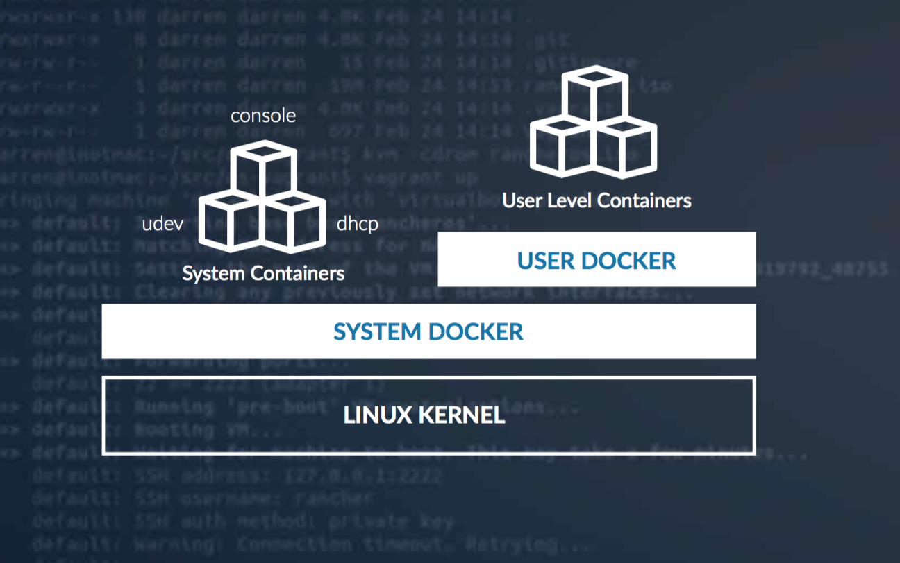

# Overview of RancherOS(RancherOSの概要)

RancherOSは、Dockerを本番環境で実行するための最小で最も簡単な方法です。
RancherOSのすべてのプロセスはDockerによって管理されるコンテナーです。
これには、`udev`や`syslog`などのシステムサービスが含まれます。
それはDockerを動かすのに必要なサービスだけを含むので、RancherOSは大部分の伝統的なオペレーティングシステムよりかなり小さいです。
不要なライブラリやサービスを削除することで、セキュリティパッチやその他のメンテナンスの要件も軽減されます。
これが可能なのは、Dockerでは、通常、ユーザーが必要なすべてのライブラリを自分のコンテナにパッケージ化しているためです。

ancherOSがDockerを実行するために特別に設計されているもう1つの方法は、常に最新バージョンのDockerを実行することです。
これにより、ユーザーは最新のDocker機能とバグ修正を利用することができます。

他のミニマリストのLinuxディストリビューションと同様に、RancherOSは驚くほど早く起動します。 Dockerコンテナーの開始は、他のプロセスの開始と同様に、ほぼ瞬時に行われます。
この速度は、マイクロサービスと自動スケーリングを採用している組織にとって理想的です。

Dockerは、開発者、システム管理者、およびDevOps用に設計されたオープンソースプラットフォームです。
シンプルで強力なコマンドラインインターフェイス（CLI）を使用して、コンテナの構築、出荷、および実行に使用されます。
Dockerを使い始めるには、[Dockerユーザーガイド](https://docs.docker.com/config/daemon/)をご覧ください。

## Hardware Requirements(ハードウェア要件)

- メモリ要件

| Platform | RAM requirement(>=v1.5.x) | RAM requirement(v1.4.x) |
| --- | --- | --- |
| Baremetal | 1GB | 1280MB |
| VirtualBox | 1GB | 1280MB |
| VMWare | 1GB | 1280MB (rancheros.iso) 2048MB (rancheros-vmware.iso) |
| GCE | 1GB | 1280MB |
| AWS | 1GB | 1.7GB |
カスタムのRancherOSを構築することでメモリ要件を調整することができます、[reduce-memory-requirements](https://rancher.com/docs/os/v1.x/en/installation/custom-builds/custom-rancheros-iso/#reduce-memory-requirements)を参照してください。

## How RancherOS Works

RancherOSのすべてはDockerコンテナです。
これを実現するには、Dockerの2つのインスタンスを起動します。
1つは**System Docker**と呼ばれるもので、これはシステム上の最初のプロセスです。
`ntpd`、`syslog`、`console` など、他のすべてのシステムサービスはDockerコンテナ内で実行されています。
System Dockerは、`systemd` のような従来のinitシステムに代わるもので、[追加のシステムサービス](https://rancher.com/docs/os/v1.x/en/installation/system-services/adding-system-services/)を起動するために使用されます。

System Dockerは、**Docker**という特別なコンテナーを実行します。
これは、ユーザーのすべてのコンテナーを管理する別のDockerデーモンです。
コンソールからユーザーとして起動したコンテナはすべてこのDocker内で実行されます。
これにより、System Dockerコンテナからの分離が実現され、通常のユーザーコマンドがシステムサービスに影響を与えないようにします。

この分離は、セキュリティ上の利点だけでなく、`docker rm -f $(docker ps -qa）`のようなコマンドでOS全体が削除されないようにするためにも作成されました。

## Running RancherOS

RancherOSを使い始めるには、[クイックスタートガイド](https://rancher.com/docs/os/v1.x/en/quick-start-guide/)に進んでください。

## Latest Release

最新のリリースについては、[README](https://github.com/rancher/os/blob/master/README.md)でリポジトリを確認してください。

