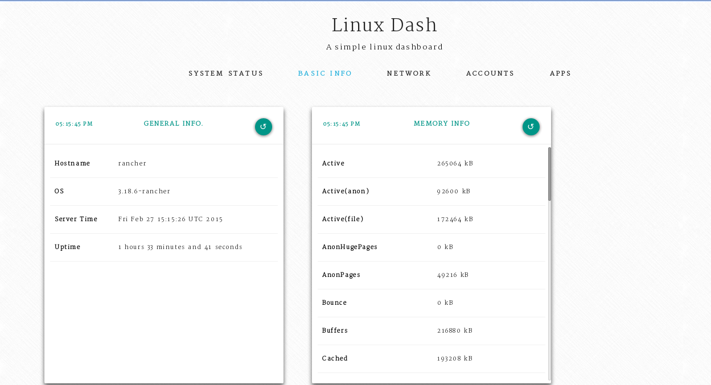

# Quick Start

特定のRanchersOSマシン要件がある場合は、[RancherOSの実行に関するガイド](https://rancher.com/docs/os/v1.x/en/installation/running-rancheros/)をご覧ください。
このガイドの残りの部分では、[Dockerマシン](https://rancher.com/docs/os/v1.x/en/installation/running-rancheros/workstation/docker-machine/)を使ってRancherOSを起動し、RancherOSにできることをいくつか紹介します。

### Launching RancherOS using Docker Machine(Docker Machineを使用してRancherOSを起動する)

先に進む前に、[Docker Machine](https://docs.docker.com/machine/)と[VirtualBox](https://www.virtualbox.org/wiki/Downloads)をインストールしておく必要があります。
VirtualBoxとDocker Machineをインストールしたら、RancherOSを実行するための1つのコマンドになります。

```
$ docker-machine create -d virtualbox \
        --virtualbox-boot2docker-url https://releases.rancher.com/os/latest/rancheros.iso \
        --virtualbox-memory 2048 \
        <MACHINE-NAME>
```

それでおしまい！ RancherOSインスタンスを起動して実行しています。

インスタンスにログインするには、`docker-machine` コマンドを使用するだけです。

```
$docker-machine ssh <MACHINE-NAME>
```

### A First Look At RancherOS

RancherOSでは2つのDockerデーモンが実行されています。
1つは `System Docker` と呼ばれ、RancherOSがntpdやsyslogなどのシステムサービスを実行する場所です。
`system-docker` コマンドを使用して **System Docker** デーモンを制御できます。

システム上で実行されている他のDockerデーモンは **Docker** です。
これには、通常の `docker` コマンドを使用してアクセスできます。

初めてRancherOSを起動したときには、Dockerデーモンで実行されているコンテナーはありません。
ただし、System Dockerに対して同じコマンドを実行すると、RancherOSに同梱されている多数のシステムサービスが表示されます。

> **Note：**  
> `system-docker` はrootだけが使用できるので、System Dockerとやり取りするときはいつでも `sudo` コマンドを使用する必要があります。

```
$ sudo system-docker ps
CONTAINER ID        IMAGE                       COMMAND                  CREATED             STATUS              PORTS               NAMES
6f56057cf5ba        rancher/os-base:v0.5.0      "/usr/sbin/entry.sh /"   16 seconds ago      Up 15 seconds                           docker
bd5376830237        rancher/os-console:v0.5.0   "/usr/sbin/entry.sh /"   16 seconds ago      Up 15 seconds                           console
ede8ce39fff5        rancher/os-base:v0.5.0      "/usr/sbin/entry.sh n"   16 seconds ago      Up 15 seconds                           network
9e5d18bca391        rancher/os-base:v0.5.0      "/usr/sbin/entry.sh n"   17 seconds ago      Up 16 seconds                           ntp
393b9fb7e30a        rancher/os-udev:v0.5.0      "/usr/sbin/entry.sh /"   18 seconds ago      Up 16 seconds                           udev
dc2cafca3c69        rancher/os-syslog:v0.5.0    "/usr/sbin/entry.sh /"   18 seconds ago      Up 17 seconds                           syslog
439d5535fbfa        rancher/os-base:v0.5.0      "/usr/sbin/entry.sh /"   18 seconds ago      Up 17 seconds                           acpid
```

いくつかのコンテナーはブート時に実行され、他のもの（`コンソール`、`docker`など）は常に実行されています。

## Using RancherOS

### Deploying a Docker Container(Dockerコンテナをデプロイする)

Dockerデーモンに通常のDockerコンテナーをデプロイしてみましょう。
RancherOS Dockerデーモンは他のDocker環境と同じであるため、通常のDockerコマンドはすべて機能します。

```
$ docker run -d nginx
```

nginxコンテナが起動して実行中であることがわかります。

```
$ docker ps
CONTAINER ID        IMAGE               COMMAND                  CREATED             STATUS              PORTS               NAMES
e99c2c4b8b30        nginx               "nginx -g 'daemon off"   12 seconds ago      Up 11 seconds       80/tcp, 443/tcp     drunk_ptolemy
```

### Deploying A System Service Container(システムサービスコンテナのデプロイ)

以下は、Linux-dash を設定するための単純なDockerコンテナです。
これは、Linuxサーバーを監視するための最小限のオーバーヘッドの少ないWebダッシュボードです。 
Dockerfileは次のようになります。

```
FROM hwestphal/nodebox
MAINTAINER hussein.galal.ahmed.11@gmail.com

RUN opkg-install unzip
RUN curl -k -L -o master.zip https://github.com/afaqurk/linux-dash/archive/master.zip
RUN unzip master.zip
WORKDIR linux-dash-master
RUN npm install

ENTRYPOINT ["node","server"]
```

Busyboxイメージを使用し、`node.js` と `npm` をインストールする `hwestphal/nodebox` イメージを使用する。
Linux-dashのソースコードをダウンロードしてから、サーバーを実行しました。
Linux-dashはデフォルトでポート80で動作します。

System Dockerでこのコンテナーを実行するには、次のコマンドを使用します。

```
$ sudo system-docker run -d --net=host --name busydash husseingalal/busydash
```

コマンドでは、`--net=host` を使用してSystem Dockerにコンテナのネットワークをコンテナ化しないように指示し、代わりにホストのネットワークを使用しました。
コンテナーを実行した後、`http://<IP_OF_MACHINE>` にアクセスしてモニターサーバーを見ることができます。



再起動中にコンテナーを存続させるには、`/opt/rancher/bin/start.sh` スクリプトを作成し、Docker開始行を追加して起動ごとにDockerを起動することができます。

```
$ sudo mkdir -p /opt/rancher/bin
$ echo "sudo system-docker start busydash" | sudo tee -a /opt/rancher/bin/start.sh
$ sudo chmod 755 /opt/rancher/bin/start.sh
```

### Using ROS

RancherOSで使用できるもう1つの便利なコマンドはシステムの制御と設定に使用できる `ros` です。

```
$ sudo ros -v
ros version 0.0.1
```

RancherOSの状態はクラウド設定ファイルによって制御されます。
`ros` はシステムの設定を編集するために使用されます。
例えば、システムのdns設定を見るためには：

```
$ sudo ros config get rancher.network.dns.nameservers
- 8.8.8.8
- 8.8.4.4
```

ネイティブのBusyboxコンソールを使用している場合、コンソールへの変更は再起動後に失われ、`/home` または `/opt` への変更のみが持続します。
`ros console switch` コマンドを使用して、[永続的コンソール](https://rancher.com/docs/os/v1.x/en/installation/custom-builds/custom-console/#console-persistence)に切り替えたり、ネイティブのBusyboxコンソールを置き換えたりすることができます。
たとえば、Ubuntuコンソールに切り替えるには：

```
$ sudo ros console switch ubuntu
```

### Conclusion(結論)

RancherOSはDockerを実行するのに理想的なシンプルなLinuxディストリビューションです。
システムサービスのコンテナー化を受け入れ、管理のためにDockerを利用することによって、RancherOSはコンテナーを実行するための非常に信頼性が高く、管理しやすいOSを提供することを望んでいます。


