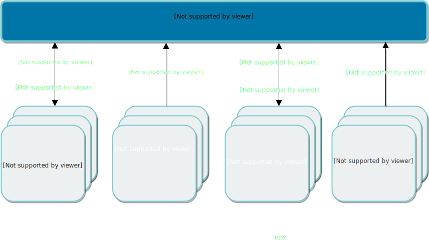

## Node Requirements(Node要件)

Rancherをシングルノードまたは高可用性セットアップのどちらで実行するように構成する場合でも、Rancher Serverを実行する各ノードは次の要件を満たす必要があります。

---
### Operating Systems and Docker

Rancherは、サポートされているバージョンの[Docker](https://www.docker.com/)を使用して、以下のオペレーティングシステムおよびそれ以降の非メジャーリリースでサポートされています。

- Ubuntu 16.04 (64-bit)
    - Docker 17.03.2, 18.06.2, 18.09.2
- Red Hat Enterprise Linux (RHEL)/CentOS 7.5 (64-bit)
    - RHEL Docker 1.13
    - Docker 17.03.2, 18.06.2, 18.09.2
- RancherOS 1.5.1 (64-bit)
    - Docker 17.03.2, 18.06.2, 18.09.2
- Windows Server version 1803 (64-bit)
    - Docker 17.06

RancherOSを使用している場合は、必ずDockerエンジンをサポートされているバージョンに切り替えてください。
```
sudo ros engine switch docker-17.03.2-ce
```

[Docker Documentation: インストール手順](https://docs.docker.com/)

---
### Hardware

ハードウェア要件は、Rancher展開の規模に基づいて調整されます。 要件に従って各ノードをプロビジョニングします。

| Deployment Size | Clusters | Nodes | vCPUs | RAM |
| --- | --- | --- | --- | --- |
| Small | Up to 5 | Up to 50 | 4 | 16GB |  
| Medium | Up to 100 | Up to 500 | 8 | 32GB |  
| Large | Over 100 | Over 500 | Contact Rancher  |  

---
### Networking

#### Node IP address

使用される各ノード（単一ノードインストール、高可用性（HA）インストール、またはクラスタで使用されるノードのいずれか）には、静的IPを構成する必要があります。
DHCPの場合は、ノードに同じIPが割り当てられていることを確認するために、ノードにDHCP予約が必要です。

#### Port requirements

HAクラスタにRancherを配置するときは、Rancherと通信できるように、ノード上の特定のポートを開く必要があります。
開く必要があるポートは、クラスタノードをホストしているマシンの種類によって異なります。
たとえば、インフラストラクチャでホストされているノードにRancherを展開している場合、SSH用にポート22を開く必要があります。
次の図は、各クラスタタイプに対して開かれているポートを示しています。




Rancher nodes:
Nodes running the `rancher/rancher` container

#### Rancher nodes - Inbound rules

| Protocol | Port | Source | Description |
| --- | --- | --- | --- |
| TCP | 80 | - Load balancer/proxy that does external SSL termination | Rancher UI/API when external SSL termination is used |
| TCP | 443 | - etcd nodes  - controlplane nodes   

#### Rancher nodes - Outbound rules

| Protocol | Port | Destination | Description |
| --- | --- | --- | --- |
| TCP | 22 | ノードドライバを使用して作成されたノードからの任意のノードIP | ノードドライバを使用したノードのSSHプロビジョニング |
| TCP | 433 | 35.160.43.145/32<br>35.167.242.46/32<br>52.33.59.17/32 | git.rancher.io (catalogs) |
| TCP | 2376 | ノードドライバを使用して作成されたノードからの任意のノードIP | Docker Machineが使用するDockerデーモンのTLSポート |
| TCP | 6443 | Hosted/Imported Kubernetes API | Kubernetes apiserver |

**etcd nodes:** ロールetcdを持つノード

#### etcd nodes - Inbound rules

| Protocol | Port | Source | Description |
| --- | --- | --- | --- |
| TCP | 2376 | Rancher nodes | Docker Machineが使用するDockerデーモンのTLSポート（ノードドライバ/テンプレートを使用する場合にのみ必要）|
| TCP | 2379 | etcd nodes<br>controlplane nodes | etcdクライアント要求 |
| TCP | 2380 | etcd nodes<br>controlplane nodes | etcd peer通信 |
| UDP | 8472 | etcd nodes<br>controlplane nodes<br>worker nodes | Canal/Flannel VXLAN overlay networking |
| TCP | 9099 | etcd nodes 自体（ノード間ではなくローカルトラフィック）<br>[ローカルノードトラフィック](https://rancher.com/docs/rancher/v2.x/en/installation/requirements/#local-node-traffic)を参照 | Canal/Flannel livenessProbe/readinessProbe |
| TCP | 10250 | コントロールプレーンノード | 	kubelet |

#### etcd nodes - Outbound rules

| Protocol | Port | Destination | Description |
| --- | --- | --- | --- |
| TCP | 443 | Rancher nodes | Rancher agent |
| TCP | 2379 | etcd nodes | etcdクライアント要求 |
| TCP | 2380 | etcd nodes | etcd peer通信 |
| TCP | 6443 | controlplane nodes | Kubernetes apiserver |
| UDP | 8472 | etcd nodes<br>controlplane nodes<br>worker nodes | Canal/Flannel VXLAN overlay networking |
| TCP | 9099 | etcd nodes 自体（ノード間ではなくローカルトラフィック）<br>[ローカルノードトラフィック](https://rancher.com/docs/rancher/v2.x/en/installation/requirements/#local-node-traffic)を参照 | Canal/Flannel livenessProbe/readinessProbe |

**controlplane nodes:** ロールコントロールプレーンを持つノード

#### controlplane nodes - Inbound rules

| Protocol | Port | Source | Description |
| --- | --- | --- | --- |
| TCP | 80 | Ingressサービスで使用 | Ingress controller (HTTP) |
| TCP | 443 | Ingressサービスで使用 | Ingress controller (HTTPS) |
| TCP | 2376 | Rancher nodes | Docker Machineが使用するDockerデーモンのTLSポート<br>（ノードドライバ/テンプレートを使用する場合にのみ必要）|
| TCP | 6443 | etcd nodes<br>controlplane nodes<br>worker nodes | Kubernetes apiserver |
| UDP | 8472 | etcd nodes<br>controlplane nodes<br>worker nodes | Canal/Flannel VXLAN overlay networking |
| TCP | 9099 | controlplane nodes自体（ノード間ではなくローカルトラフィック）<br>[ローカルノードトラフィック](https://rancher.com/docs/rancher/v2.x/en/installation/requirements/#local-node-traffic)を参照 | Canal/Flannel livenessProbe/readinessProbe |
| TCP | 10250 | controlplane nodes | kubelet |
| TCP | 10254 | controlplane nodes自体（ノード間ではなくローカルトラフィック）<br> [ローカルノードトラフィック](https://rancher.com/docs/rancher/v2.x/en/installation/requirements/#local-node-traffic)を参照 | Ingress controller livenessProbe/readinessProbe |
| TCP/UDP | 30000-32767 | NodePortサービスを利用するあらゆるソース | NodePortポート範囲 |

#### controlplane nodes - Outbound rules

| Protocol | Port | Destination | 	Description |
| --- | --- | --- | --- |
| TCP | 443 | Rancher nodes | Rancher agent |
| TCP | 2379 | etcd nodes | etcdクライアント要求 |
| TCP | 2380 | etcd nodes | etcd peer通信 |
| UDP | 8472 | etcd nodes<br>controlplane nodes<br>worker nodes | Canal/Flannel VXLAN overlay networking |
| TCP | 9099 | controlplane node自体（ノード間ではなくローカルトラフィック）<br>[ローカルノードトラフィック](https://rancher.com/docs/rancher/v2.x/en/installation/requirements/#local-node-traffic)を参照 | Canal/Flannel livenessProbe/readinessProbe |
| TCP | 10250 | etcd nodes<br>controlplane nodes<br>worker nodes | kubelet |
| TCP | 10254 | controlplane node自体（ノード間ではなくローカルトラフィック）<br>[ローカルノードトラフィック](https://rancher.com/docs/rancher/v2.x/en/installation/requirements/#local-node-traffic)を参照 | Ingress controller livenessProbe/readinessProbe |

**worker nodes:**  Nodes with the role worker

#### worker nodes - Inbound rules

| Protocol | Port | Source | Description |
| --- | --- | --- | --- |
| TCP | 80 | Ingressサービスで使用 | Ingress controller (HTTP) |
| TCP | 443 | Ingressサービスで使用 | Ingress controller (HTTPS) |
| TCP | 2376 | Rancher nodes | Docker Machineが使用するDockerデーモンのTLSポート<br>（ノードドライバ/テンプレートを使用する場合にのみ必要）
| UDP | 8472 | etcd nodes<br>controlplane nodes<br>worker nodes | Canal/Flannel VXLAN overlay networking |
| TCP | 9099 | worker node自体（ノード間ではなくローカルトラフィック）<br>[ローカルノードトラフィック](https://rancher.com/docs/rancher/v2.x/en/installation/requirements/#local-node-traffic)を参照 | Canal/Flannel livenessProbe/readinessProbe |
| TCP | 10250 | controlplane nodes | kubelet |
| TCP | 10254 | worker node自体（ノード間ではなくローカルトラフィック）<br>[ローカルノードトラフィック](https://rancher.com/docs/rancher/v2.x/en/installation/requirements/#local-node-traffic)を参照 | Ingress controller livenessProbe/readinessProbe |
| TCP/UDP | 30000-32767 | NodePortサービスを利用するあらゆるソース | NodePortポート範囲 |

#### worker nodes - Outbound rules

| Protocol | Port | Destination | Description |
| --- | --- | --- | --- |
| TCP | 443 | Rancher nodes | Rancher agent |
| TCP | 6443 | controlplane nodes | 	Kubernetes apiserver |
| UDP | 8472 | etcd nodes<br>controlplane nodes<br>worker nodes | Canal/Flannel VXLAN overlay networking |
| TCP | 9099 | worker node自体（ノード間ではなくローカルトラフィック）<br>[ローカルノードトラフィック](https://rancher.com/docs/rancher/v2.x/en/installation/requirements/#local-node-traffic)を参照 | Canal/Flannel livenessProbe/readinessProbe |
| TCP | 10254 | worker node自体（ノード間ではなくローカルトラフィック）<br>[ローカルノードトラフィック](https://rancher.com/docs/rancher/v2.x/en/installation/requirements/#local-node-traffic)を参照 | Ingress controller livenessProbe/readinessProbe |

### Information on local node traffic

Kubernetesヘルスチェック（livenessProbeとreadinessProbe）はホスト自体で実行されます。
ほとんどのノードで、これはデフォルトで許可されています。
ノードに厳密なホストファイアウォール（iptables）ポリシーを適用した場合、または複数のインタフェースを持つノード（マルチホーム）を使用している場合、このトラフィックはブロックされます。
この場合、セキュリティグループ設定で、ホストファイアウォール、またはパブリック/プライベートクラウドでホストされているマシン（つまり、AWSまたはOpenStack）でこのトラフィックを明示的に許可する必要があります。
セキュリティグループを送信元または送信先としてセキュリティグループで使用する場合、これはノード/インスタンスのプライベートインターフェイスにのみ適用されることに注意してください。

### Amazon EC2 security group when using Node Driver

Amazon EC2クラスターを作成している場合は、Rancherにrancher-nodesという名前のセキュリティグループを作成させることを選択できます。
次の規則がこのセキュリティグループに自動的に追加されます。

**Security group: rancher-nodes**

#### Inbound rules

| Type | Protocol | Port Range | Source |
| --- | --- | --- | --- |
| SSH | TCP | 22 | 0.0.0.0/0 |
| HTTP | TCP | 80 | 0.0.0.0/0 |
| Custom TCP Rule | TCP | 443 | 0.0.0.0/0 |
| Custom TCP Rule | TCP | 2376 | 0.0.0.0/0 |
| Custom TCP Rule | TCP | 2379-2380 | sg-xxx (rancher-nodes) |
| Custom UDP Rule | UDP | 4789 | sg-xxx (rancher-nodes) |
| Custom TCP Rule | TCP | 6443 | 0.0.0.0/0 |
| Custom UDP Rule | UDP | 8472 | sg-xxx (rancher-nodes) |
| Custom TCP Rule | TCP | 10250-10252 | sg-xxx (rancher-nodes)
| Custom TCP Rule | TCP | 10256 | sg-xxx (rancher-nodes) |
| Custom TCP Rule | TCP | 30000-32767 | 0.0.0.0/0 |
| Custom UDP Rule | UDP | 30000-32767 | 0.0.0.0/0 |

#### Outbound rules

| Type | Protocol | Port Range | Source |
| --- | --- | --- | --- |
| All traffic | All | All | 0.0.0.0/0 |

